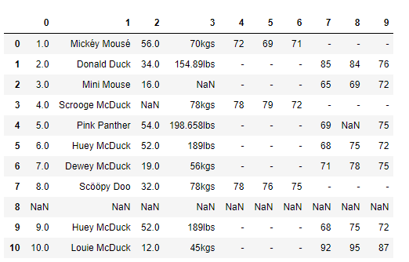
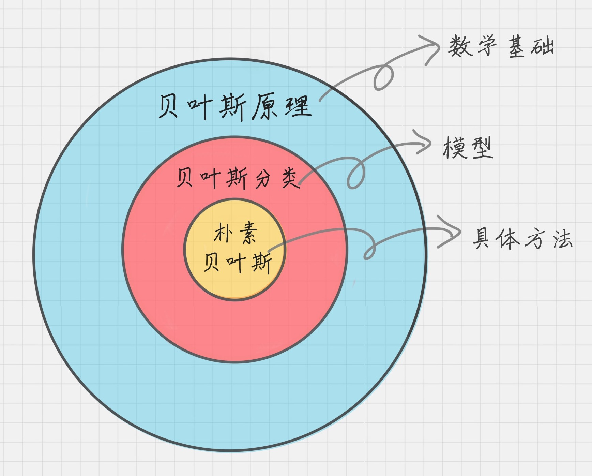
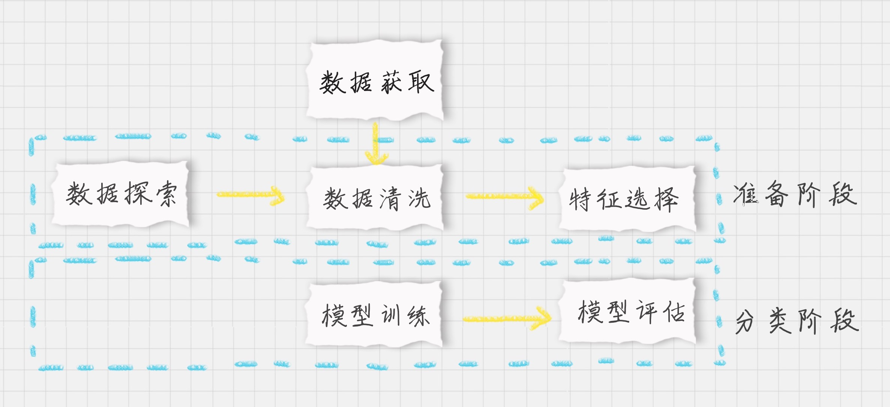
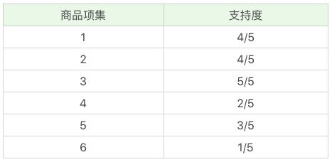
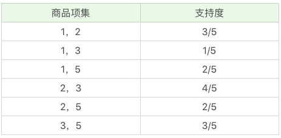
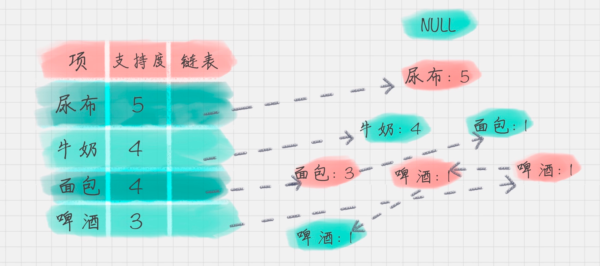
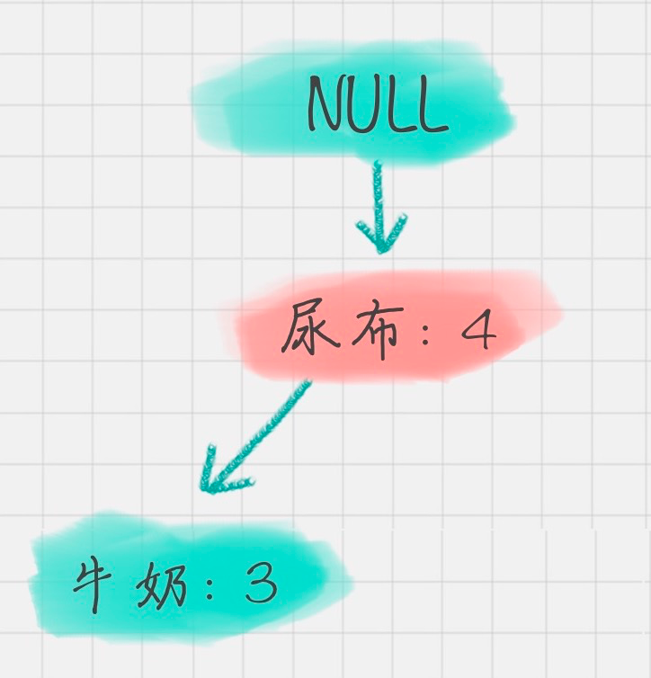

<center ><h1>数据挖掘</h1></center>

[TOC]

# 1 数据领域
## 1.1 数据采集
**数据源**：
- 开源数据源
- 爬虫抓取
- 日志采集
- 传感器

**数据获取工具**：
- 八爪鱼
- python爬虫
## 1.2 数据挖掘
数据挖掘的核心是挖掘数据的商业价值，也就是我们所谈的商业智能 BI。掌握如下内容
### 1.2.1 基本流程

1. **商业理解**
数据挖掘不是我们的目的，我们的目的是更好地帮助业务，所以第一步我们要从商业的角度理解项目需求，在这个基础上，再对数据挖掘的目标进行定义。

2. **数据理解**
尝试收集部分数据，然后对数据进行探索，包括数据描述、数据质量验证等。这有助于对收集的数据有个初步的认知。

3. **数据准备**
开始收集数据，并对数据进行清洗、数据集成等操作，完成数据挖掘前的准备工作。

4. **模型建立**
选择和应用各种数据挖掘模型，并进行优化，以便得到更好的分类结果。

5. **模型评估**
对模型进行评价，并检查构建模型的每个步骤，确认模型是否实现了预定的商业目标。

6. **上线发布**
模型的作用是从数据中找到金矿，也就是我们所说的“知识”，获得的知识需要转化成用户可以使用的方式，呈现的形式可以是一份报告，也可以是实现一个比较复杂的、可重复的数据挖掘过程。数据挖掘结果如果是日常运营的一部分，那么后续的监控和维护就会变得重要。

### 1.2.2 十大算法
- **分类算法**
    1. **c4.5**
    C4.5 是决策树的算法，它创造性地在决策树构造过程中就进行了剪枝，并且可以处理连续的属性，也能对不完整的数据进行处理。它可以说是决策树分类中，具有里程碑式意义的算法。
    2. 朴素贝叶斯（Naive Bayes）
    朴素贝叶斯模型是基于概率论的原理，它的思想是这样的：对于给出的未知物体想要进行分类，就需要求解在这个未知物体出现的条件下各个类别出现的概率，哪个最大，就认为这个未知物体属于哪个分类。
    3. SVM
    SVM 的中文叫支持向量机，英文是 Support Vector Machine，简称 SVM。SVM 在训练中建立了一个超平面的分类模型。
    4. KNN
    KNN 也叫 K 最近邻算法，英文是 K-Nearest Neighbor。所谓 K 近邻，就是每个样本都可以用它最接近的 K 个邻居来代表。如果一个样本，它的 K 个最接近的邻居都属于分类A，那么这个样本也属于分类 A。
    5. Adaboost
    Adaboost 在训练中建立了一个联合的分类模型。boost 在英文中代表提升的意思，所以Adaboost 是个构建分类器的提升算法。它可以让我们多个弱的分类器组成一个强的分类器，所以 Adaboost 也是一个常用的分类算法。
    6. CART
    CART 代表分类和回归树，英文是 Classification and Regression Trees。像英文一样，它构建了两棵树：一颗是分类树，另一个是回归树。和 C4.5 一样，它是一个决策树学习方法。

-  **聚类算法**
    1. K-Means
    K-Means 算法是一个聚类算法。可以这么理解，最终我想把物体划分成 K 类。假设每个类别里面，都有个“中心点”，即意见领袖，它是这个类别的核心。现在我有一个新点要归类，这时候就只要计算这个新点与 K 个中心点的距离，距离哪个中心点近，就变成了哪个类别。
    2. EM
    EM 算法也叫最大期望算法，是求参数的最大似然估计的一种方法。原理是这样的：假设我们想要评估参数 A 和参数 B，在开始状态下二者都是未知的，并且知道了 A 的信息就可以得到 B 的信息，反过来知道了 B 也就得到了 A。可以考虑首先赋予 A 某个初值，以此得到 B 的估值，然后从 B 的估值出发，重新估计 A 的取值，这个过程一直持续到收敛为止。
    **EM 算法经常用于聚类和机器学习领域中。**

- **关联分析**
    - Apriori
    Apriori 是一种挖掘关联规则（association rules）的算法，它通过挖掘频繁项集（frequent item sets）来揭示物品之间的关联关系，被广泛应用到商业挖掘和网络安全等领域中。**频繁项集**是指经常出现在一起的物品的集合，**关联规则**暗示着两种物品之间可能存在很强的关系。

-  **接连分析**
    - PageRank
    PageRank 起源于论文影响力的计算方式，如果一篇文论被引入的次数越多，就代表这篇论文的影响力越强。同样 PageRank 被 Google 创造性地应用到了网页权重的计算中：当一个页面链出的页面越多，说明这个页面的“参考文献”越多，当这个页面被链入的频率越高，说明这个页面被引用的次数越高。基于这个原理，我们可以得到网站的权重划分。
### 1.2.3 数学基础
1. **概率论与数理统计**
2. **线性代数**
3. 图论
4. 最优化方法
## 1.3 数据可视化
数据往往是隐性的，尤其是当数据量大的时候很难感知，可视化可以帮我们很好地理解这些数据的结构，以及分析结果的呈现。
1. python可视化
    - Matplotib库
    - Seaborn库
2. 第三方工具
如果已经生成了 csv 格式文件可采用以下方式：
- 微图
- DataV
- Data GIF Marker
# 2 Python常用基本库
## 2.1 Python的NumPy库
### 2.1.1 NumPy库的优点
1. 节省计算资源
python列表 list 的元素在系统内存中是分散存储的，而 NumPy 数组存储在一个均匀连续的内存块中。这样数组计算遍历所有的元素，不像列表 list 还需要对内存地址进行查找，从而节省了计算资源

2. 访问效率更高
在内存访问模式中，缓存会直接把字节块从 RAM 加载到 CPU 寄存器中。因为数据连续的存储在内存中，NumPy 直接利用现代 CPU 的矢量化指令计算，加载寄存器中的多个连续浮点数。

3. 计算效率更高
NumPy 中的矩阵计算可以采用多线程的方式，充分利用多核 CPU 计算资源，大大提升了计算效率
### 2.1.2 NumPy库的应用
#### 2.1.2.1 ndarray 对象
ndarray（N-dimensional array object）解决了多维数组问题
ndarray 对象是用于存放同类型元素的多维数组。
ndarray 中的每个元素在内存中都有相同存储大小的区域。

- NumPy 最重要的一个特点是其 N 维数组对象 ndarray，它是一系列同类型数据的集合，以 0 下标为开始进行集合中元素的索引。
- NumPy 数组的维数称为秩（rank），秩就是轴的数量，即数组的维度，一维数组的秩为 1，二维数组的秩为 2，以此类推。
- NumPy中，每一个线性的数组称为是一个轴（axis），也就是维度（dimensions）。比如说，二维数组相当于是两个一维数组，其中第一个一维数组中每个元素又是一个一维数组。所以一维数组就是 NumPy 中的轴（axis），第一个轴相当于是底层数组，第二个轴是底层数组里的数组。而轴的数量——秩，就是数组的维数。很多时候可以声明 axis。axis=0，表示沿着第 0 轴进行操作，即对每一列进行操作；axis=1，表示沿着第1轴进行操作，即对每一行进行操作。
#### 2.1.2.2 ufunc对象
ufunc（universal function object）是解决对数组进行处理的函数，它们是对 ndarray 对象进行操作的 NumPy 函数。
ufunc 用于在 NumPy 中实现矢量化，这比迭代元素要快得多。它们还提供广播和其他方法，例如减少、累加等，它们对计算非常有帮助。ufuncs 还接受其他参数，比如：
- where 布尔值数组或条件，用于定义应在何处进行操作。
- dtype 定义元素的返回类型。
- out 返回值应被复制到的输出数组。

**向量化**
将迭代语句转换为基于向量的操作称为向量化。由于现代 CPU 已针对此类操作进行了优化，因此速度更快。
对两个列表的元素进行相加：
```
list 1: [1, 2, 3, 4]
list 2: [4, 5, 6, 7]
```
一种方法是遍历两个列表，然后对每个元素求和。
```python
x = [1, 2, 3, 4]
y = [4, 5, 6, 7]
z = []
for i, j in zip(x, y):
  z.append(i + j)
print(z)
```
另一种通过 ufunc，我们可以使用 add() 函数：
```python
import numpy as np
x = [1, 2, 3, 4]
y = [4, 5, 6, 7]
z = np.add(x, y)
print(z)
```
**算数运算**
通过 NumPy 可以自由地创建等差数组，同时也可以进行加、减、乘、除、求 n 次方和取余数
```python
import numpy as np
x1 = [1, 2, 3, 4]
x2 = [4, 5, 6, 7]
np.add(x1, x2)   # 加
np.subtract(x1, x2) # 减
np.multiply(x1, x2) # 乘
np.divide(x1, x2) # 除
np.power(x1, x2) # n 次方
np.remainder(x1, x2) # 取余数
```
**统计函数**
计数组 / 矩阵中的最大值函数 amax()，最小值函数 amin()
```python
import numpy as np
a = np.array([[1,2,3], [4,5,6], [7,8,9]])
np.amin(a)			# a中所有元素最小值 1
np.amin(a,0)		# a中每一列中的最小值 [1,2,3]
np.amin(a,1)		# a中没一行中的最小值 [1,4,7]
np.amax(a)          # a中所有元素最大值 9
np.amax(a,0)        # a中每一列中的最小值 [7,8,9]
np.amax(a,1)        # a中没一行中的最小值 [3,6,9]
```
**统计最大值与最小值之差 ptp()**
```python
import numpy as np
a = np.array([[1,2,3], [4,5,6], [7,8,9]])
np.ptp(a)     #8
np.ptp(a,0)   # [6 6 6]    7-1=6,8-2=6,9-3=6
np.ptp(a,1)   # [2 2 2]	 3-1=2,6-4=2,9-7=2
```
**统计数组的百分位数 percentile()**
```python
import numpy as np
a = np.array([[1,2,3], [4,5,6], [7,8,9]])
np.percentile(a, 50)                    #5.0  相当于所有值的平均值
np.percentile(a, 50, axis=0)            #[4. 5. 6.]相当于每一列的中间值
np.percentile(a, 50, axis=1)			#[2. 5. 8.]相当于每一行的平均值
```
percentile() 代表着第 p 个百分位数，这里 p 的取值范围是 0-100，如果 p=0，那么就是求最小值，如果 p=50 就是求平均值，如果 p=100 就是求最大值。
**统计数组中的中位数 median()、平均数 mean()**
```python
import numpy as np
a = np.array([[1,2,3], [4,5,6], [7,8,9]])
# 求中位数
np.median(a) #5.0
np.median(a, axis=0) #[4. 5. 6.]
np.median(a, axis=1) #[2. 5. 8.]
# 求平均数
np.mean(a)       #5.0  
np.mean(a, axis=0)  #[4. 5. 6.]
np.mean(a, axis=1)  #[2. 5. 8.]
```
**统计数组中的加权平均值 average()**
```python
import numpy as np
a = np.array([1,2,3,4])
wts = np.array([1,2,3,4])
np.average(a)   #2.5   (1+2+3+4)/4=2.5
np.average(a,weights=wts) #3.0 (1*1+2*2+3*3+4*4)/(1+2+3+4)=3.0
```

**统计数组中的标准差 std()、方差 var()**
```python
import numpy as np
a = np.array([1,2,3,4])
np.std(a) 1.118033988749895
np.var(a) 1.25
```
**NumPy 排序**
```python
import numpy as np
a = np.array([[4,3,2],[2,4,1]])
np.sort(a)  #[[2 3 4],[1 2 4]]
np.sort(a, axis=None) #[1 2 2 3 4 4]
np.sort(a, axis=0) #[[2 3 1],[4 4 2]]
np.sort(a, axis=1) #[[2 3 4],[1 2 4]]
```
## 2.2 Python的Pandas库
Pandas 的使用频率是很高
- 一方面是因为 Pandas 提供的基础数据结构 DataFrame 与 json 的契合度很高，转换起来就很方便。
- 另一方面，如果日常的数据清理工作不是很复杂的话，通常用几句 Pandas 代码就可以对数据进行规整。
### 2.2.1 Series数据结构
**Series 是个定长的字典序列。**说是定长是因为在存储的时候，相当于两个 ndarray，这也是和字典结构最大的不同。因为在字典的结构里，元素的个数是不固定的。
Series有两个基本属性：**index 和 values。**在 Series 结构中，index 默认是 0,1,2,……递增的整数序列，当然我们也可以自己来指定索引，比如 index=[‘a’, ‘b’, ‘c’,‘d’]
```python
import pandas as pd
from pandas import Series, DataFrame
x1 = Series([1,2,3,4])
x2 = Series(data=[1,2,3,4], index=['a', 'b', 'c', 'd'])
print(x1)
print(x2)

#结果
0 1
1 2
2 3
3 4
dtype: int64
a 1
b 2
c 3
d 4
dtype: int64
#这个例子中，x1 中的 index 采用的是默认值，x2 中 index 进行了指定。
```
### 2.2.2 DataFrame数据结构
**DataFrame 类型数据结构类似数据库表**，它包括了行索引和列索引，我们可以将 DataFrame看成是由相同索引的 Series 组成的字典类型。
```python
import pandas as pd
from pandas import Series, DataFrame
data = {'Chinese': [66, 95, 93, 90,80],'English': [65, 85, 92, 88, 90],'Math': [30, 98, 96, 77, 90]}
df1= DataFrame(data)
df2 = DataFrame(data, index=['ZhangFei', 'GuanYu', 'ZhaoYun', 'HuangZhong', 'DianWei'], columns=['English', 'Math', 'Chinese'])
print(df1)
print(df2)

#结果
   Chinese  English  Math
0       66       65    30
1       95       85    98
2       93       92    96
3       90       88    77
4       80       90    90

            English  Math  Chinese
ZhangFei         65    30       66
GuanYu           85    98       95
ZhaoYun          92    96       93
HuangZhong       88    77       90
DianWei          90    90       80
```

### 2.2.3 数据处理
#### 2.2.3.1 数据导入和输出
Pandas允许直接从xlsx，csv等文件中导入数据，也可以输出到xlsx, csv等文件，非常方便。
```python
import pandas as pd
from pandas import Series, DataFrame
score = DataFrame(pd.read_excel('data.xlsx'))
score.to_excel('data1.xlsx')
print(score)
```
#### 2.2.3.2 数据清洗
以前面的数据为例
```python
data = {'Chinese': [66, 95, 93, 90,80],'English': [65, 85, 92, 88, 90],'Math': [30, 98, 96, 77, 90]}
df2 = DataFrame(data, index=['ZhangFei', 'GuanYu', 'ZhaoYun', 'HuangZhong', 'DianWei'], columns=['English', 'Math', 'Chinese'])
```
1. **删除 DataFrame 中的不必要的列或行**
```python
df2 = df2.drop(columns=['Chinese']) #把“语文”这列删掉。 
df2 = df2.drop(index=['ZhangFei']) #把“张飞”这行删掉。
```
2. **重命名列名columns，让列表名更容易识别**
```python
df2.rename(columns={'Chinese': 'YuWen', 'English': 'Yingyu'}, inplace = True) #把列名Chinese改成YuWen，English改成YingYu。
```
3. **去重复的值**
```python 
df = df.drop_duplicates() #去除重复行
```
4. **格式问题**
更改数据格式
```python 
df2['Chinese'].astype('str') #把Chinese字段的值改成str类型
df2['Chinese'].astype(np.int64) #把Chinese字段的值改成int64类型
```
数据间的空格
```python 
#使用strip函数
#删除左右两边空格
df2['Chinese']=df2['Chinese'].map(str.strip)
#删除左边空格
df2['Chinese']=df2['Chinese'].map(str.lstrip)
#删除右边空格
df2['Chinese']=df2['Chinese'].map(str.rstrip)
```
大小写转换
```python 
#全部大写
df2.columns = df2.columns.str.upper()
#全部小写
df2.columns = df2.columns.str.lower()
#首字母大写
df2.columns = df2.columns.str.title()
```
查找空值
数据量大的情况下，有些字段存在空值 NaN 的可能，这时就需要使用 Pandas 中的 isnull函数进行查找

5. **用apply 函数清洗数据**
如果对name列的数值都进行大写转化可以用
`df['name'] = df['name'].apply(str.upper)`
可以定义个函数，在apply中进行使用。比如定义double_df函数是将原来的数值\*2进行返回。然后对df1中的“语文”列的数值进行\*2处理
```python
def double_df(x):
    return 2*x
df1[u'语文'] = df1[u'语文'].apply(double_df)
```
也可以定义更复杂的函数，比如对于DataFrame，我们新增两列，其中’new1’列是“语文”和“英语”成绩之和的m倍，'new2’列是“语文”和“英语”成绩之和的n倍，我们可以这样写：
```python
def plus(df,n,m):
    df['new1'] = (df[u'语文']+df[u'英语']) * m
    df['new2'] = (df[u'语文']+df[u'英语']) * n
    return df
df1 = df1.apply(plus,axis=1,args=(2,3,))
'''
其中axis=1代表按照列为轴进行操作，axis=0代表按照行为轴进行操作，args是传递的两个参数，即n=2, m=3，在plus函数中使用到了n和m，从而生成新的df
'''
```
#### 2.2.3.3 数据统计
Pandas和NumPy一样，都有常用的统计函数，如果遇到空值NaN，会自动排除。
1. **函数**


表格中有一个 describe() 函数，。它是个统计大礼包，可以快速让我们对数据有个全面的了解
```python
df1 = DataFrame({'name':['ZhangFei', 'GuanYu', 'a', 'b', 'c'], 'data1':range(5)})
print(df1.describe())
# 结果
       data1
count  5.000000
mean   2.000000
std    1.581139
min    0.000000
25%    1.000000
50%    2.000000
75%    3.000000
max    4.000000
```
2. 数据表合并
创建两个 DataFrame
```python
df1 = DataFrame({'name':['ZhangFei', 'GuanYu', 'a', 'b', 'c'], 'data1':range(5)})
df2 = DataFrame({'name':['ZhangFei', 'GuanYu', 'A', 'B', 'C'], 'data2':range(5)})
```
两个 DataFrame 数据表的合并使用的是 merge() 函数，有下面 5 种形式：
-  基于指定列进行连接
```python
df3 = pd.merge(df1, df2, on='name') #基于 name 这列进行连接
#结果
       name  data1  data2
0  ZhangFei      0      0
1    GuanYu      1      1
```
- inner 内连接
```python
df3 = pd.merge(df1, df2, how='inner') 
'''
inner 内连接其实也就是键的交集，在这里 df1,df2 相同的键是 name，所以是基于 name 字段做的连接：
'''
#结果
       name  data1  data2
0  ZhangFei      0      0
1    GuanYu      1      1
```
- inner 内连接
```python
df3 = pd.merge(df1, df2, how='inner') #基于 name 这列进行连接
#结果
       name  data1  data2
0  ZhangFei      0      0
1    GuanYu      1      1
```
- left 左连接
```python
df3 = pd.merge(df1, df2, how='left') 
'''
以第一个 DataFrame 为主进行的连接，第二个 DataFrame 作为补充
'''
#结果
       name  data1  data2
0  ZhangFei      0    0.0
1    GuanYu      1    1.0
2         a      2    NaN
3         b      3    NaN
4         c      4    NaN
```
-  right 右连接
```python
df3 = pd.merge(df1, df2, how='right') 
'''
以第二个 DataFrame 为主进行的连接，第一个 DataFrame 作为补充
'''
#结果
        name  data1  data2
0  ZhangFei    0.0      0
1    GuanYu    1.0      1
2         A    NaN      2
3         B    NaN      3
4         C    NaN      4
```
- outer 外连接
```python
df3 = pd.merge(df1, df2, how='outer') 
'''
相当于求两个 DataFrame 的并集。
'''
#结果
       name  data1  data2
0  ZhangFei    0.0    0.0
1    GuanYu    1.0    1.0
2         a    2.0    NaN
3         b    3.0    NaN
4         c    4.0    NaN
5         A    NaN    2.0
6         B    NaN    3.0
7         C    NaN    4.0
```
# 3 基本概念
## 3.1 数据挖掘的流程
### 3.1.1 数据挖掘的任务
在数据挖掘中，有几个非常重要的任务，就是分类、聚类、预测和关联分析。
1. 分类
就是通过训练集得到一个分类模型，然后用这个模型可以对其他数据进行分类。
**训练集和测试集的概念：**一般来说数据可以划分为训练集和测试集。训练集是用来给机器做训练的，通常是人们整理好训练数据，以及这些数据对应的分类标识。通过训练，机器就产生了自我分类的模型，然后机器就可以拿着这个分类模型，对测试集中的数据进行分类预测。同样如果测试集中，人们已经给出了测试结果，我们就可以用测试结果来做验证，从而了解分类器在测试环境下的表现。
2. 聚类
人以群分，物以类聚。聚类就是将数据自动聚类成几个类别，聚到一起的相似度大，不在一起的差异性大。往往利用聚类来做数据划分。
3. 预测
顾名思义，就是通过当前和历史数据来预测未来趋势，它可以更好地帮助我们识别机遇和风险。
4. 关联分析
就是发现数据中的关联规则，它被广泛应用在购物篮分析，或事务数据分析中。比如我们开头提到的那个案例。
通过下面步骤完成以上任务


### 3.1.2 数据预处理
1. 数据清洗
主要是为了去除重复数据，去噪声（即干扰数据）以及填充缺失值。
2. 数据集成
是将多个数据源中的数据存放在一个统一的数据存储中。
3. 数据变换
就是将数据转换成适合数据挖掘的形式。比如，通过归一化将属性数据按照比例缩放，这样就可以将数值落入一个特定的区间内，比如0~1之间。
## 3.2 数据自动化采集
### 3.2.1 python爬虫抓取数据
**Request库：**获取网页所有信息
**Xpath定位lxml库：**解析网页，得到我们需要的数据
**Pandas库： **操作数据（数据清洗，保存数据。。。）

1. 使用 Requests 爬取内容。我们可以使用 Requests 库来抓取网页信息。Requests 库
可以说是 Python 爬虫的利器，也就是 Python 的 HTTP 库，通过这个库爬取网页中的
数据，非常方便，可以帮我们节约大量的时间。
2. 使用 XPath 解析内容。XPath 是 XML Path 的缩写，也就是 XML 路径语言。它是一种
用来确定 XML 文档中某部分位置的语言，在开发中经常用来当作小型查询语言。
XPath 可以通过元素和属性进行位置索引。
3. 使用 Pandas 保存数据。Pandas 是让数据分析工作变得更加简单的高级数据结构，我
们可以用 Pandas 保存爬取的数据。最后通过 Pandas 再写入到 XLS 或者 MySQL 等数
据库中。

Requests、XPath、Pandas 是 Python 的三个利器。当然做 Python 爬虫还有很多利器，比如 Selenium，PhantomJS，或者用 Puppteteer 这种无头模式
### 3.2.2 其他抓取数据工具
<a href="http://www.locoy.com/" style="text-decoration:none">火车采集器</a>
<a href="http://www.bazhuayu.com/" style="text-decoration:none"><b>八爪鱼</b></a>
<a href="http://www.gooseeker.com/" style="text-decoration:none">集搜客</a>

### 3.2.3 日志采集
日志采集可以分两种形式

1. 通过 Web 服务器采集，例如 httpd、Nginx、Tomcat 都自带日志记录功能。同时很多互联网企业都有自己的海量数据采集工具，多用于系统日志采集，如 Hadoop 的Chukwa、Cloudera 的 Flume、Facebook 的 Scribe 等，这些工具均采用分布式架构，能够满足每秒数百 MB 的日志数据采集和传输需求。
2. 自定义采集用户行为，例如用 JavaScript 代码监听用户的行为、AJAX 异步请求后台记录日志等。

**埋点：**埋点就是在有需要的位置采集相应的信息，进行上报。
埋点就是在你需要统计数据的地方植入统计代码，当然植入代码可以自己写，也可以使用第三方统计工具。一般来说需要自己写的代码，一般是主营核心业务，对于埋点这类监测性的工具，市场上已经比较成熟，这里推荐你使用第三方的工具，比如友盟、**Google Analysis、Talkingdata **等。他们都是采用前端埋点的方式，然后在第三方工具里就可以看到用户的行为数据。但如果我们想要看到更深层的用户操作行为，就需要进行自定义埋点。

### 3.2.4 python爬虫示列
1. **Requests 访问页面**
`r = requests.get('http://www.douban.com')`
代码里的“r”就是 Get 请求后的访问结果，然后我们可以使用 r.text 或 r.content 来获取HTML 的正文。
 使用 Post 进行表单传递，代码就可以这样写
`r = requests.post('http://xxx.com', data = {'key':'value'})`
这里 data 就是传递的表单参数，data 的数据类型是个字典的结构，采用 key 和 value 的方式进行存储。
有时候当我们直接用Requests获取HTML的时候，发现想要的XPath并不存在。这是因为HTML还没有加载完，因此你需要一个工具，来进行网页加载的模拟，直到完成加载后再给你完整的HTML。
在Python中，这个工具就是Selenium库，使用方法如下:
```python
from selenium import webdriver
driver = webdriver.Chrome()
driver.get(request_url)
```
2. **XPath定位**
XPath 是 XML 的路径语言，实际上是通过元素和属性进行导航，帮我们定位位置。它有几种常用的路径表达方式。

| 表达式 | 含义                                 |
| ------ | ------------------------------------ |
| node   | 选node节点的所有子节点               |
| /      | 从根节点选取                         |
| //     | 选取所有的当前节点，不考虑他们的位置 |
| .      | 当前节点                             |
| ..     | 父节点                               |
| @      | 属性选择                             |
| \|     | 或，两个节点的合计                   |
| text() | 当前路径下的文本内容                 |

例子： 
- xpath(‘node’) 选取了 node 节点的所有子节点；
- xpath(’/div’) 从根节点上选取 div 节点；
- xpath(’//div’) 选取所有的 div 节点；
- xpath(’./div’) 选取当前节点下的 div 节点；
- xpath(’…’) 回到上一个节点；
- xpath(’//@id’) 选取所有的 id 属性；
- xpath(’//book[@id]’) 选取所有拥有名为 id 的属性的 book 元素；
- xpath(’//book[@id=“abc”]’) 选取所有 book 元素，且这些 book 元素拥有 id="abc"的属性；
- xpath(’//book/title | //book/price’) 选取 book 元素的所有 title 和 price元素。

使用 XPath 定位，会用到 Python 的一个解析库 lxml
```python
from lxml import etree
html = etree.HTML(html)
result = html.xpath('//li')
```
## 3.3 数据清洗的重要性
拿做饭打个比方吧，对于很多人来说，热油下锅、掌勺翻炒一定是做饭中最过瘾的环节，但实际上炒菜这个过程只占做饭时间的20%，剩下80%的时间都是在做准备，比如买菜、择菜、洗菜等等。在数据挖掘中，数据清洗就是这样的前期准备工作。
### 3.3.1 数据质量的准则
数据清洗规则总结为以下4个关键点，统一起来叫“完全合一”

1. 完整性：单条数据是否存在空值，统计的字段是否完善。
2. 全面性：观察某一列的全部数值，比如在Excel表中，我们选中一列，可以看到该列的平均值、最大值、最小值。我们可以通过常识来判断该列是否有问题，比如：数据定义、单位标识、数值本身。
3. 合法性：数据的类型、内容、大小的合法性。比如数据中存在非ASCII字符，性别存在了未知，年龄超过了150岁等。
4. 唯一性：数据是否存在重复记录，因为数据通常来自不同渠道的汇总，重复的情况是常见的。行数据、列数据都需要是唯一的，比如一个人不能重复记录多次，且一个人的体重也不能在列指标中重复记录多次。
### 3.3.2 使用Pandas清洗数据
依照“完全合一”的准则，使用Pandas来进行清洗如下数据。



#### 3.3.2.1 清洗之完整性
**问题1：缺失值**
在数据中有数值是缺失的，这往往是因为数据量较大，在采集过程中，有些数值没有采集到。通常我们可以采用以下三种方法：

- 删除：删除数据缺失的记录；
- 均值：使用当前列的均值；
- 高频：使用当前列出现频率最高的数据。

```python
df['Age'].fillna(df['Age'].mean(), inplace=True)   #用age列的平均值，填充那些值为空的栏

age_maxf = train_features['Age'].value_counts().index[0]   #获取age列中出现次数最多的值
train_features['Age'].fillna(age_maxf, inplace=True)     # 用出现次数最多的值填充值为空的栏
```
**问题2：空行**
```python
# 删除全空的行
df.dropna(how='all',inplace=True) 
```
#### 3.3.2.2 清洗之全面性
**问题：列数据的单位不统一**
weight列的数值，我们能发现weight 列的单位不统一。有的单位是千克（kgs），有的单位是磅（lbs）。
这里我使用千克作为统一的度量单位，将磅（lbs）转化为千克（kgs）：

```python
# 获取 weight 数据列中单位为 lbs 的数据
rows_with_lbs = df['weight'].str.contains('lbs').fillna(False)
print(df[rows_with_lbs])
# 将 lbs转换为 kgs, 2.2lbs=1kgs
for i,lbs_row in df[rows_with_lbs].iterrows():
	# 截取从头开始到倒数第三个字符之前，即去掉lbs。
	weight = int(float(lbs_row['weight'][:-3])/2.2)
	df.at[i,'weight'] = '{}kgs'.format(weight) 
```
#### 3.3.2.3 清洗之合理性
**问题：非ASCII字符**
在数据集中 Fristname 和 Lastname 有一些非 ASCII 的字符。我们可以采用删除或者替换的方式来解决非ASCII问题，这里我们使用删除方法：
```python
# 删除非 ASCII 字符
df['first_name'].replace({r'[^\x00-\x7F]+':''}, regex=True, inplace=True)
df['last_name'].replace({r'[^\x00-\x7F]+':''}, regex=True, inplace=True)
```
#### 3.3.2.4 清洗之唯一性
**问题1：一列有多个参数**
姓名列（Name）包含了两个参数 Firtname 和 Lastname。为了达到数据整洁目的，我们将 Name 列拆分成 Firstname 和 Lastname两个字段。我们使用Python的split方法，str.split(expand=True)，将列表拆成新的列，再将原来的 Name 列删除。
```python
# 切分名字，删除源数据列
df[['first_name','last_name']] = df['name'].str.split(expand=True)
df.drop('name', axis=1, inplace=True)
```
**问题2：重复数据**
如果存在重复记录，就使用 Pandas 提供的 drop_duplicates() 来删除重复数据。

```python
# 删除重复数据行
df.drop_duplicates(['first_name','last_name'],inplace=True)
```

# 4 数据集成
数据集成分为ETL型和ELT型


ETL 是英文 Extract、Transform 和 Load 的缩写，顾名思义它包括了数据抽取、转换、加载三个过程。ETL 可以说是进行数据挖掘这项工作前的“备菜”过程。
典型的 ETL 工具有:
商业软件：Informatica PowerCenter、IBM InfoSphere DataStage、Oracle Data
Integrator、Microsoft SQL Server Integration Services 等
开源软件：Kettle、Talend、Apatar、Scriptella、DataX、Sqoop 等

## 4.1 Kettle 
Kettle 是一款国外开源的 ETL 工具，纯 Java 编写，可以在 Window 和 Linux 上运行，不需要安装就可以使用。Kettle 中文名称叫水壶，该项目的目标是将各种数据放到一个壶里，然后以一种指定的格式流出。
## 4.2 DataX
阿里开源软件，但 DataX 可以实现跨平台、跨数据库、不同系统之间的数据同步及交互，它将自己作为标准，连接了不同的数据源，以完成它们之间的转换
## 4.3 Sqoop
Sqoop 是一款开源的工具，是由 Apache 基金会所开发的分布式系统基础架构。Sqoop
在 Hadoop 生态系统中是占据一席之地的，它主要用来在 Hadoop 和关系型数据库中传
递数据。通过 Sqoop，我们可以方便地将数据从关系型数据库导入到 HDFS 中，或者将
数据从 HDFS 导出到关系型数据库中


# 5 数据变换
在数据变换前，我们需要先对字段进行筛选，然后对数据进行探索和相关性分析，接着是选择算法模型（这里暂时不需要进行模型计算），然后针对算法模型对数据的需求进行数据变换，从而完成数据挖掘前的准备工作。


数据变换是数据准备的重要环节，它通过数据平滑、数据聚集、数据概化和规范化等方式将数据转换成适用于数据挖掘的形式。
常见的变换方法：

1. **数据平滑**：去除数据中的噪声，将连续数据离散化。这里可以采用分箱、聚类和回归的方式进行数据平滑；
2. **数据聚集**：对数据进行汇总，在SQL中有一些聚集函数可以供我们操作，比如Max()反馈某个字段的数值最大值，Sum()返回某个字段的数值总和；
3. **数据概化**：将数据由较低的概念抽象成为较高的概念，减少数据复杂度，即用更高的概念替代更低的概念。比如说上海、杭州、深圳、北京可以概化为中国。
4. **数据规范化**：使属性数据按比例缩放，这样就将原来的数值映射到一个新的特定区域中。常用的方法有最小—最大规范化、Z—score 规范化、按小数定标规范化等；
5. **属性构造**：构造出新的属性并添加到属性集中。这里会用到特征工程的知识，因为通过属性与属性的连接构造新的属性，其实就是特征工程。比如说，数据表中统计每个人的英语、语文和数学成绩，你可以构造一个“总和”这个属性，来作为新属性。这样“总和”这个属性就可以用到后续的数据挖掘计算中。
## 5.1 数据规范化方法
### 5.1.1 Min-max 规范化
Min-max标准化方法是将原始数据变换到[0,1]的空间中。用公式表示就是：
新数值=（原数值-极小值）/（极大值-极小值）。

### 5.1.2 Z-Score 规范化
假设A与B的考试成绩都为80分，A的考卷满分是100分（及格60分），B的考卷满分是500分（及格300分）。虽然两个人都考了80分，但是A的80分与B的80分代表完全不同的含义。
定义：新数值=（原数值-均值）/ 标准差。
假设A所在的班级平均分为80，标准差为10。B所在的班级平均分为400，标准差为100。那么A的新数值=(80-80)/10=0，B的新数值=(80-400)/100=-3.2。
那么在Z-Score标准下，A的成绩会比B的成绩好。
Z-Score的优点是算法简单，不受数据量级影响，结果易于比较。不足在于，它需要数据整体的平均值和方差，而且结果没有实际意义，只是用于比较。
### 5.1.3 小数定标规范化
小数定标规范化就是通过移动小数点的位置来进行规范化。小数点移动多少位取决于属性A的取值中的最大绝对值。
举个例子，比如属性A的取值范围是-999到88，那么最大绝对值为999，小数点就会移动3位，即新数值=原数值/1000。那么A的取值范围就被规范化为-0.999到0.088。

## 5.2 python SciKit-Learn库的数据规范化应用
SciKit-Learn是Python的重要机器学习库，它帮我们封装了大量的机器学习算法，比如分类、聚类、回归、降维等。此外，它还包括了数据变换模块。
### 5.2.1 Min-max 规范化
在SciKit-Learn里有个函数MinMaxScaler是专门做这个的，它允许我们给定一个最大值与最小值，然后将原数据投射到[min, max]中。默认情况下[min,max]是[0,1]，也就是把原始数据投放到[0,1]范围内。
```python
# coding:utf-8
from sklearn import preprocessing
import numpy as np
# 初始化数据，每一行表示一个样本，每一列表示一个特征
x = np.array([[ 0., -3.,  1.],
              [ 3.,  1.,  2.],
              [ 0.,  1., -1.]])
# 将数据进行[0,1]规范化
min_max_scaler = preprocessing.MinMaxScaler()
minmax_x = min_max_scaler.fit_transform(x)
print(minmax_x)
# 结果
[[0.         0.         0.66666667]
 [1.         1.         1.        ]
 [0.         1.         0.        ]]

```
### 5.2.2  Z-Score规范化
在SciKit-Learn库中使用preprocessing.scale()函数，可以直接将给定数据进行Z-Score规范化。
```python
from sklearn import preprocessing
import numpy as np
# 初始化数据
x = np.array([[ 0., -3.,  1.],
              [ 3.,  1.,  2.],
              [ 0.,  1., -1.]])
# 将数据进行Z-Score规范化
scaled_x = preprocessing.scale(x)
print scaled_x
# 结果
[[-0.70710678 -1.41421356  0.26726124]
 [ 1.41421356  0.70710678  1.06904497]
 [-0.70710678  0.70710678 -1.33630621]]
```
这个结果实际上就是将每行每列的值减去了平均值，再除以方差的结果。
我们看到Z-Score规范化将数据集进行了规范化，**数值都符合均值为0，方差为1的正态分布。**
### 5.2.3 小数定标规范化
```python
# coding:utf-8
from sklearn import preprocessing
import numpy as np
# 初始化数据
x = np.array([[ 0., -3.,  1.],
              [ 3.,  1.,  2.],
              [ 0.,  1., -1.]])
# 标准差标准化
j = np.ceil(np.log10(np.max(abs(x))))
scaled_x = x/(10**j)
print(scaled_x)

# 运行结果：
[[ 0.  -0.3  0.1]
 [ 0.3  0.1  0.2]
 [ 0.   0.1 -0.1]]
```
在数据变换中，重点是如何将数值进行规范化，有三种常用的规范方法，分别是Min-Max规范化、Z-Score规范化、小数定标规范化。其中Z-Score规范化可以直接将数据转化为正态分布的情况，当然不是所有自然界的数据都需要正态分布，我们也可以根据实际的情况进行设计，比如取对数log，或者神经网络里采用的激励函数等。

# 6 python数据可视化
常用的可视化视图超过 20 种，分别包括：文本表、热力图、地图、符号地图、饼图、水平条、堆叠条、并排条、树状图、圆视图、并排圆、线、双线、面积图、双组合、散点图、直方图、盒须图、甘特图、靶心图、气泡图
使用这些视图的目的如下图所示：


**Matplotlib**是Python的可视化基础库，作图风格和MATLAB类似，所以称为Matplotlib。一般学习Python数据可视化，都会从Matplotlib入手，然后再学习其他的Python可视化库。
**Seaborn**是一个基于Matplotlib的高级可视化效果库，针对Matplotlib做了更高级的封装，让作图变得更加容易。可以用短小的代码绘制更多维度数据的可视化效果图。
## 6.1 可视化视图分类
### 6.1.1按照数据之间的关系分类
可以把可视化视图划分为4类，它们分别是比较、联系、构成和分布。
1. 比较：比较数据间各类别的关系，或者是它们随着时间的变化趋势，比如折线图；
2. 联系：查看两个或两个以上变量之间的关系，比如散点图；
3. 构成：每个部分占整体的百分比，或者是随着时间的百分比变化，比如饼图；
4. 分布：关注单个变量，或者多个变量的分布情况，比如直方图。

### 6.1.2 按照变量的个数
可以把可视化视图划分为单变量分析和多变量分析。
**单变量分析**指的是一次只关注一个变量。比如我们只关注“身高”这个变量，来看身高的取值分布，而暂时忽略其他变量。
**多变量分析**可以在一张图上查看两个以上变量的关系。比如“身高”和“年龄”，可以理解是同一个人的两个参数，这样在同一张图中可以看到每个人的“身高”和“年龄”的取值，从而分析出来这两个变量之间是否存在某种联系。

## 6.2 十大主要视图
主要包括了散点图、折线图、直方图、条形图、箱线图、饼图、热力图、蜘蛛图、二元变量分布和成对关系。


### 6.2.1 散点图
```python
import matplotlib.pyplot as plt
import seaborn as sns
import pandas as pd
# 数据准备
N = 1000
x = np.random.randn(N)
y = np.random.randn(N)
# 用Matplotlib画散点图
plt.scatter(x, y,marker='x') # x、y 是坐标，marker代表了标记的符号比如“x”、“>”或者“o” 不同的marker，呈现出来的符号样式也会不同
plt.show()
# 用Seaborn画散点图
df = pd.DataFrame({'x': x, 'y': y})
sns.jointplot(x="x", y="y", data=df, kind='scatter');#其中x、y是data中的下标。data就是我们要传入的数据，一般是DataFrame类型。kind这类我们取scatter，代表散点的意思。当然kind还可以取其他值，不同的kind代表不同的视图绘制方式。
plt.show()
```
### 6.2.2 折线图
```python
import matplotlib.pyplot as plt
import seaborn as sns
import pandas as pd
# 数据准备
x = [2010, 2011, 2012, 2013, 2014, 2015, 2016, 2017, 2018, 2019]
y = [5, 3, 6, 20, 17, 16, 19, 30, 32, 35]
# 使用Matplotlib画折线图
plt.plot(x, y)  # 需要提前把数据按照x轴的大小进行排序，要不画出来的折线图就无法按照x轴递增的顺序展示。
plt.show()
# 使用Seaborn画折线图
df = pd.DataFrame({'x': x, 'y': y})
sns.lineplot(x="x", y="y", data=df)
plt.show()
```
### 6.2.3 直方图
```python
import matplotlib.pyplot as plt
import seaborn as sns
import pandas as pd
import numpy as np
# 数据准备
a = np.random.randn(100)
s = pd.Series(a) 
# 用Matplotlib画直方图
plt.hist(s) 
plt.show()
# 用Seaborn画直方图
sns.distplot(s, kde=False)
plt.show()
sns.distplot(s, kde=True)
plt.show()
'''
plt.hist(x, bins=10)函数，其中参数x是一维数组，bins代表直方图中的箱子数量，默认是10。

sns.distplot(x, bins=10, kde=True)函数。其中参数x是一维数组，bins代表直方图中的箱子数量，kde代表显示核密度估计，默认是True，我们也可以把kde设置为False，不进行显示。核密度估计是通过核函数帮我们来估计概率密度的方法。
'''
```
### 6.2.4 条形图
如果说通过直方图可以看到变量的数值分布，那么条形图可以帮我们查看类别的特征。在条形图中，长条形的长度表示类别的频数，宽度表示类别。
```python
import matplotlib.pyplot as plt
import seaborn as sns
# 数据准备
x = ['Cat1', 'Cat2', 'Cat3', 'Cat4', 'Cat5']
y = [5, 4, 8, 12, 7]
# 用Matplotlib画条形图
plt.bar(x, y)
plt.show()
# 用Seaborn画条形图
sns.barplot(x, y)
plt.show()
'''
plt.bar(x, height)函数，其中参数x代表x轴的位置序列，height是y轴的数值序列，也就是柱子的高度。

sns.barplot(x=None, y=None, data=None)函数。其中参数data为DataFrame类型，x、y是data中的变量。
'''
```
### 6.2.5 箱线图
箱线图，又称盒式图，它是在1977年提出的，由五个数值点组成：最大值(max)、最小值(min)、中位数(median)和上下四分位数(Q3, Q1)。它可以帮我们分析出数据的差异性、离散程度和异常值等。
```python
import matplotlib.pyplot as plt
import seaborn as sns
import pandas as pd
import numpy as np
# 数据准备
# 生成0-1之间的10*4维度数据
data=np.random.normal(size=(10,4)) 
lables = ['A','B','C','D']
# 用Matplotlib画箱线图
plt.boxplot(data,labels=lables)
plt.show()
# 用Seaborn画箱线图
df = pd.DataFrame(data, columns=lables)
sns.boxplot(data=df)
plt.show()
'''
plt.boxplot(x, labels=None)函数，其中参数x代表要绘制箱线图的数据，labels是缺省值，可以为箱线图添加标签。

sns.boxplot(x=None, y=None, data=None)函数。其中参数data为DataFrame类型，x、y是data中的变量。 
'''
```
### 6.2.6 饼图
```python
import matplotlib.pyplot as plt
# 数据准备
nums = [25, 37, 33, 37, 6]
labels = ['High-school','Bachelor','Master','Ph.d', 'Others']
# 用Matplotlib画饼图
plt.pie(x = nums, labels=labels)
plt.show()
'''
plt.pie(x, labels=None)函数，其中参数x代表要绘制饼图的数据，labels是缺省值，可以为饼图添加标签。
'''
```
### 6.2.7 热力图
热力图，英文叫heat map，是一种矩阵表示方法，其中矩阵中的元素值用颜色来代表，不同的颜色代表不同大小的值。通过颜色就能直观地知道某个位置上数值的大小。另外也可以将这个位置上的颜色，与数据集中的其他位置颜色进行比较。
```python
import matplotlib.pyplot as plt
import seaborn as sns
# 数据准备,使用Seaborn中自带的数据集flights，该数据集记录了1949年到1960年期间，每个月的航班乘客的数量。
flights = sns.load_dataset("flights")
data=flights.pivot('year','month','passengers')
# 用Seaborn画热力图
sns.heatmap(data)
plt.show()
```
### 6.2.8 蜘蛛图
蜘蛛图是一种显示一对多关系的方法。在蜘蛛图中，一个变量相对于另一个变量的显著性是清晰可见的。
```python
import matplotlib.pyplot as plt
import seaborn as sns
import numpy as np
# 数据准备
labels=np.array([u"推进","KDA",u"生存",u"团战",u"发育",u"输出"])
stats=[83, 61, 95, 67, 76, 88]
# 画图数据准备，角度、状态值
angles=np.linspace(0, 2*np.pi, len(labels), endpoint=False)
stats=np.concatenate((stats,[stats[0]]))
angles=np.concatenate((angles,[angles[0]]))
# 用Matplotlib画蜘蛛图
fig = plt.figure()
ax = fig.add_subplot(111, polar=True)   
ax.plot(angles, stats, 'o-', linewidth=2)
ax.fill(angles, stats, alpha=0.25)
# 设置中文字体
font = FontProperties(fname=r"C:\Windows\Fonts\simhei.ttf", size=14)  
ax.set_thetagrids(angles * 180/np.pi, labels, FontProperties=font)
plt.show()

'''
代码中flt.figure是创建一个空白的figure对象，这样做的目的相当于画画前先准备一个空白的画板。然后add_subplot(111)可以把画板划分成1行1列。再用ax.plot和ax.fill进行连线以及给图形上色。最后我们在相应的位置上显示出属性名。这里需要用到中文，Matplotlib对中文的显示不是很友好，因此我设置了中文的字体font，这个需要在调用前进行定义
'''
```
### 6.2.9 二元变量分布
想要看两个变量之间的关系，就需要用到二元变量分布。当然二元变量分布有多种呈现方式，开头给你介绍的散点图就是一种二元变量分布。
```python
import matplotlib.pyplot as plt
import seaborn as sns
# 数据准备,使用Seaborn中自带的数据集tips，这个数据集记录了不同顾客在餐厅的消费账单及小费情况。
tips = sns.load_dataset("tips")
print(tips.head(10))
# 用Seaborn画二元变量分布图（散点图，核密度图，Hexbin图）
sns.jointplot(x="total_bill", y="tip", data=tips, kind='scatter')
sns.jointplot(x="total_bill", y="tip", data=tips, kind='kde')
sns.jointplot(x="total_bill", y="tip", data=tips, kind='hex')
plt.show()
```
### 6.2.10 成对关系
```python
import matplotlib.pyplot as plt
import seaborn as sns
# 数据准备
iris = sns.load_dataset('iris')
# 用Seaborn画成对关系
sns.pairplot(iris)
plt.show()
'''
这里我们使用Seaborn中自带的iris数据集，这个数据集也叫鸢尾花数据集。鸢尾花可以分成Setosa、Versicolour和Virginica三个品种，在这个数据集中，针对每一个品种，都有50个数据，每个数据中包括了4个属性，分别是花萼长度、花萼宽度、花瓣长度和花瓣宽度。
'''
```
# 7 算法
## 7.1 决策树
在决策树的构造中，一个决策树包括根节点、子节点、叶子节点。在属性选择的标准上，度量方法包括了信息增益和信息增益率。在算法上，我讲解了两种算法：ID3和C4.5，其中ID3是基础的决策树算法，C4.5在它的基础上进行了改进，也是目前决策树中应用广泛的算法。


### 7.1.1 决策树的构造和剪枝

在做决策树的时候，会经历两个阶段构造和剪枝
#### 7.1.1.1 构造
构造的过程就是选择什么属性作为节点的过程，那么在构造过程中，会存在三种节点：
1. 根节点：就是树的最顶端，最开始的那个节点；
2. 内部节点：就是树中间的那些节点；
3. 叶节点：就是树最底部的节点，也就是决策结果。

在构造过程中，要解决三个重要的问题：
1. 选择哪个属性作为根节点；
2. 选择哪些属性作为子节点；
3. 什么时候停止并得到目标状态，即叶节点。

#### 7.1.1.2 剪枝
**过拟合**：它指的就是模型的训练结果“太好了”，以至于在实际应用的过程中，会存在“死板”的情况，导致分类错误
**欠拟合**：欠拟合，和过拟合就好比是下面这张图中的第一个和第三个情况一样，训练的结果“太好“，反而在实际应用过程中会导致分类错误。

**泛化能力**：指的分类器是通过训练集抽象出来的分类能力，可以理解是举一反三的能力。如果我们太依赖于训练集的数据，那么得到的决策树容错率就会比较低，泛化能力差。因为训练集只是全部数据的抽样，并不能体现全部数据的特点。
**预剪枝**：在决策树构造时就进行剪枝。方法是在构造的过程中对节点进行评估，如果对某个节点进行划分，在验证集中不能带来准确性的提升，那么对这个节点进行划分就没有意义，这时就会把当前节点作为叶节点，不对其进行划分。
**后剪枝**：在生成决策树之后再进行剪枝，通常会从决策树的叶节点开始，逐层向上对每个节点进行评估。如果剪掉这个节点子树，与保留该节点子树在分类准确性上差别不大，或者剪掉该节点子树，能在验证集中带来准确性的提升，那么就可以把该节点子树进行剪枝。方法是：用这个节点子树的叶子节点来替代该节点，类标记为这个节点子树中最频繁的那个类。

### 7.1.2 概念
#### 7.1.2.1 纯度
可以把决策树的构造过程理解成为寻找纯净划分的过程。数学上，可以用纯度来表示，纯度换一种方式来解释就是让目标变量的分歧最小。
例子，假设有3个集合：

- 集合1：6次都去打篮球；
- 集合2：4次去打篮球，2次不去打篮球；
- 集合3：3次去打篮球，3次不去打篮球。

按照纯度指标来说，集合1>集合2>集合3。因为集合1的分歧最小，集合3的分歧最大。
#### 7.1.2.2 熵
熵（entropy）表示信息的不确定度。在信息论中，随机离散事件出现的概率存在着不确定性。为了衡量这种信息的不确定性，信息学之父香农引入了信息熵的概念，并给出了计算信息熵的数学式：

$ Entropy(t) = - \sum_{i=0}^{c-1}p(i|t)log_2p(i|t) $

p(i|t)代表了节点t为分类i的概率，其中log2为取以2为底的对数。当不确定性越大时，它所包含的信息量也就越大，信息熵也就越高。
例子，假设有2个集合

- 集合1：5次去打篮球，1次不去打篮球；
- 集合2：3次去打篮球，3次不去打篮球。

集合1中的熵为：
Entropy(t) = -(1/6)log~2~(1/6) - (5/6)log~2~(5/6) = 0.65
集合2中的熵为：
Entropy(t) = -(3/6)log~2~(3/6) - (3/6)log~2~(3/6) = 1
从上面的计算结果中可以看出，信息熵越大，纯度越低。当集合中的所有样本均匀混合时，信息熵最大，纯度最低。

#### 7.1.2.3 信息增益
信息增益指的就是划分可以带来纯度的提高，信息熵的下降。它的计算公式，是父亲节点的信息熵减去所有子节点的信息熵。在计算的过程中，我们会计算每个子节点的归一化信息熵，即按照每个子节点在父节点中出现的概率，来计算这些子节点的信息熵。所以信息增益的公式可以表示为：

$ Gain(D,a) = Entropy(D) - \sum_{i=1}^{k}\frac{D_i}{D}Entropy(D_i) $

公式中D是父亲节点，Di是子节点，Gain(D,a)中的a作为D节点的属性选择。
列子，假设三个叶子节点。D1、D2和D3，分别对应的是晴天、阴天和小雨。我们用+代表去打篮球，-代表不去打篮球。

- D1(天气=晴天)={1-,2-,6+}
- D2(天气=阴天)={3+,7-}
- D3(天气=小雨)={4+,5-}

根节点的信息熵是：
Ent(D) = -((3/7)log~2~(3/7)+(4/7)log~2~(4/7)) = y   (假如为y)
三个叶子节点的信息熵：

$$
Ent(D_1) = -(\frac{1}{3}log_2\frac{1}{3}+\frac{2}{3}log_2\frac{2}{3}) = 0.918 \\
Ent(D_2) = -(\frac{1}{2}log_2\frac{1}{2}+\frac{1}{2}log_2\frac{1}{2}) = 1.0 \\
Ent(D_3) = -(\frac{1}{2}log_2\frac{1}{2}+\frac{1}{2}log_2\frac{1}{2}) = 1.0
$$

因为D1有3个记录，D2有2个记录，D3有2个记录，所以D中的记录一共是3+2+2=7，即总数为7。所以D1在D（父节点）中的概率是3/7，D2在父节点的概率是2/7，D3在父节点的概率是2/7。那么作为子节点的归一化信息熵= 3/7\*0.918+2/7\*1.0+2/7\*1.0=0.965。
因为信息增益来构造决策树，所以要计算每个节点的信息增益。
天气作为属性节点的信息增益为，Gain(D ,天气)=y-0.965。
若将其他属性的信息增益计算出来：
Gain(D ,天气)=y-0.857=0
Gain(D ,湿度)=y-0.965
Gain(D ,刮风)=y-0.965
我们能看出来温度作为属性的信息增益最大。将温度作为根节点

#### 7.1.2.4 信息增益率
信息增益率=信息增益/属性熵
### 7.1.3 ID3算法
ID3算法就是用信息增益实现的,将信息增益最大的节点作为父节点。它的可解释性强。比如ID3算法倾向于选择取值比较多的属性。这样，如果我们把“编号”作为一个属性（一般情况下不会这么做，这里只是举个例子），那么“编号”将会被选为最优属性 。但实际上“编号”是无关属性的，它对“打篮球”的分类并没有太大作用。
ID3有一个缺陷就是，有些属性可能对分类任务没有太大作用，但是他们仍然可能会被选为最优属性。这种缺陷不是每次都会发生，只是存在一定的概率。在大部分情况下，ID3都能生成不错的决策树分类。

### 7.1.4 C4.5算法
针对ID3可能发生的缺陷C4.5算法进行改进。
1. 采用信息增益率
当属性有很多值的时候，相当于被划分成了许多份，虽然信息增益变大了，但是对于C4.5来说，属性熵也会变大，所以整体的信息增益率并不大。
2. 采用悲观剪枝
ID3构造决策树的时候，容易产生过拟合的情况。在C4.5中，会在决策树构造之后采用悲观剪枝（PEP），这样可以提升决策树的泛化能力。
悲观剪枝是后剪枝技术中的一种，通过递归估算每个内部节点的分类错误率，比较剪枝前后这个节点的分类错误率来决定是否对其进行剪枝。这种剪枝方法不再需要一个单独的测试数据集。
3. 离散化处理连续属性
C4.5可以处理连续属性的情况，对连续的属性进行离散化的处理。比如打篮球存在的“湿度”属性，不按照“高、中”划分，而是按照湿度值进行计算，那么湿度取什么值都有可能。该怎么选择这个阈值呢，**C4.5选择具有最高信息增益的划分所对应的阈值。**
4. 处理缺失值
针对数据集不完整的情况，C4.5也可以进行处理。
例子，有7个数据，但有一个数据缺失。可以得到温度D={2-,3+,4+,5-,6+,7-}。温度=高：D1={2-,3+,4+} ；温度=中：D2={6+,7-}；温度=低：D3={5-} 。这里+号代表打篮球，-号代表不打篮球。比如ID=2时，决策是不打篮球，我们可以记录为2-。
所以三个叶节点的信息熵可以结算为：

$$
Ent(D_1') = -(\frac{3}{6}log_2\frac{3}{6}+\frac{3}{6}log_2\frac{3}{6}) = 1.0 \\
Ent(D_1') = -(\frac{1}{2}log_2\frac{1}{2}+\frac{1}{2}log_2\frac{1}{2}) = 1.0 \\
Ent(D_3) = 0
$$

这三个节点的归一化信息熵为3/6\*1.0+2\*1.0+1/6\*0=0.833。
针对将属性选择为温度的信息增益率为：

$ Gain(D',温度) = Ent(D') - 0.833 = 1.0 - 0.833 = 0.167 $

D′的样本个数为6，而D的样本个数为7，所以所占权重比例为6/7，所以Gain（D′，温度）所占权重比例为6/7，所以：

$ Gain(D,温度) = \frac{6}{7}*0.167 = 0.143 $

### 7.1.4 CART算法
CART算法，英文全称叫做Classification And Regression Tree，中文叫做分类回归树。ID3和C4.5算法可以生成二叉树或多叉树，而CART只支持二叉树。同时CART决策树比较特殊，既可以作分类树，又可以作回归树。
分类树可以处理离散数据，也就是数据种类有限的数据，它输出的是样本的类别，而回归树可以对连续型的数值进行预测，也就是数据在某个区间内都有取值的可能，它输出的是一个数值。
#### 7.1.4.1  CART分类树的工作流程
决策树的核心就是寻找纯净的划分，因此引入了纯度的概念。在属性选择上，我们是通过统计“不纯度”来做判断的，ID3是基于信息增益做判断，C4.5在ID3的基础上做了改进，提出了信息增益率的概念。实际上CART分类树与C4.5算法类似，只是属性选择的指标采用的是基尼系数。

在经济学中有基尼系数，它是用来衡量一个国家收入差距的常用指标。当基尼系数大于0.4的时候，说明财富差异悬殊。基尼系数在0.2-0.4之间说明分配合理，财富差距不大。

基尼系数本身反应了样本的不确定度。当基尼系数越小的时候，说明样本之间的差异性小，不确定程度低。分类的过程本身是一个不确定度降低的过程，即纯度的提升过程。所以CART算法在构造分类树的时候，会选择基尼系数最小的属性作为属性的划分。
假设t为节点，那么该节点的GINI系数的计算公式为：

$ GINI(t) = 1 - \sum_{k}[p(C_k|t)]^2 $

这里p(Ck|t)表示节点t属于类别Ck的概率，节点t的基尼系数为1减去各类别Ck概率平方和。

例子：
- 集合1：6个都去打篮球；
- 集合2：3个去打篮球，3个不去打篮球。

针对集合1，所有人都去打篮球，所以p(Ck|t)=1，因此GINI(t)=1-1=0。
针对集合2，有一半人去打篮球，而另一半不去打篮球，所以，p(C1|t)=0.5，p(C2|t)=0.5，GINI(t)=1-（0.5*0.5+0.5*0.5）=0.5。
通过两个基尼系数你可以看出，集合1的基尼系数最小，也证明样本最稳定，而集合2的样本不稳定性更大。

在CART算法中，基于基尼系数对特征属性进行二元分裂，假设属性A将节点D划分成了D1和D2，如下图所示：


节点D的基尼系数等于子节点D1和D2的归一化基尼系数之和，用公式表示为：

$ GINI(D,A) = \frac{D_1}{D}GINI(D_1) + \frac{D_2}{D}GINI(D_2) $

归一化基尼系数代表的是每个子节点的基尼系数乘以该节点占整体父亲节点D中的比例。
上面我们已经计算了集合D1和集合D2的GINI系数，得到：
GINI(D~1~)=0
GINI(D~2~)=0.5

所以节点D的基尼系数为：
GINI(D,A)=6/12GINI(D~1~)+6/12GINI(D~2~)=0.25
节点D被属性A划分后的基尼系数越大，样本集合的不确定性越大，也就是不纯度越高。

#### 7.1.4.2 使用CART算法来创建分类树
在Python的sklearn中，如果我们想要创建CART分类树，可以直接使用DecisionTreeClassifier这个类。创建这个类的时候，默认情况下criterion这个参数等于gini，也就是按照基尼系数来选择属性划分，即默认采用的是CART分类树。
用CART分类树，给iris数据集构造一棵分类决策树。iris这个数据集，我在Python可视化中讲到过，实际上在sklearn中也自带了这个数据集。基于iris数据集，构造CART分类树的代码如下：
```python
# encoding=utf-8
from sklearn.model_selection import train_test_split
from sklearn.metrics import accuracy_score
from sklearn.tree import DecisionTreeClassifier
from sklearn.datasets import load_iris
# 准备数据集
iris=load_iris()
# 获取特征集和分类标识
features = iris.data
labels = iris.target
# 随机抽取33%的数据作为测试集，其余为训练集
train_features, test_features, train_labels, test_labels = train_test_split(features, labels, test_size=0.33, random_state=0)
# 创建CART分类树
clf = DecisionTreeClassifier(criterion='gini')
# 拟合构造CART分类树
clf = clf.fit(train_features, train_labels)
# 用CART分类树做预测
test_predict = clf.predict(test_features)
# 预测结果与测试集结果作比对
score = accuracy_score(test_labels, test_predict)
print("CART分类树准确率 %.4lf" % score)

'''
首先train_test_split可以帮助我们把数据集抽取一部分作为测试集，这样我们就可以得到训练集和测试集。

使用clf = DecisionTreeClassifier(criterion=‘gini’)初始化一棵CART分类树。这样你就可以对CART分类树进行训练。

使用clf.fit(train_features, train_labels)函数，将训练集的特征值和分类标识作为参数进行拟合，得到CART分类树。

使用clf.predict(test_features)函数进行预测，传入测试集的特征值，可以得到测试结果test_predict。

最后使用accuracy_score(test_labels, test_predict)函数，传入测试集的预测结果与实际的结果作为参数，得到准确率score。

sklearn做CART分类树，使用起来还是很方便的。
'''
```
#### 7.1.4.3 CART回归树的工作流程
CART回归树划分数据集的过程和分类树的过程是一样的，只是回归树得到的预测结果是连续值，而且评判“不纯度”的指标不同。在CART分类树中采用的是基尼系数作为标准，那么在CART回归树中，要根据样本的混乱程度，也就是样本的离散程度来评价“不纯度”。

样本的离散程度具体的计算方式是，先计算所有样本的均值，然后计算每个样本值到均值的差值。我们假设x为样本的个体，均值为u。为了统计样本的离散程度，我们可以取差值的绝对值，或者方差。

其中差值的绝对值为样本值减去样本均值的绝对值：

$|x-μ|$

方差为每个样本值减去样本均值的平方和除以样本个数：

$s = \frac{1}{n}*\sum{(x-u)^2}$

所以这两种节点划分的标准，分别对应着两种目标函数最优化的标准，即用最小绝对偏差（LAD），或者使用最小二乘偏差（LSD）。这两种方式都可以让我们找到节点划分的方法，通常使用最小二乘偏差的情况更常见一些。
#### 7.1.4.4 使用CART回归树做预测
使用到sklearn自带的波士顿房价数据集，该数据集给出了影响房价的一些指标，比如犯罪率，房产税等，最后给出了房价。
```python
# encoding=utf-8
from sklearn.metrics import mean_squared_error
from sklearn.model_selection import train_test_split
from sklearn.datasets import load_boston
from sklearn.metrics import r2_score,mean_absolute_error,mean_squared_error
from sklearn.tree import DecisionTreeRegressor
# 准备数据集
boston=load_boston()
# 探索数据
print(boston.feature_names)
# 获取特征集和房价
features = boston.data
prices = boston.target
# 随机抽取33%的数据作为测试集，其余为训练集
train_features, test_features, train_price, test_price = train_test_split(features, prices, test_size=0.33)
# 创建CART回归树
dtr=DecisionTreeRegressor()
# 拟合构造CART回归树
dtr.fit(train_features, train_price)
# 预测测试集中的房价
predict_price = dtr.predict(test_features)
# 测试集的结果评价
print('回归树二乘偏差均值:', mean_squared_error(test_price, predict_price))
print('回归树绝对值偏差均值:', mean_absolute_error(test_price, predict_price)) 
'''
使用dtr=DecisionTreeRegressor()初始化一棵CART回归树。

使用dtr.fit(train_features, train_price)函数，将训练集的特征值和结果作为参数进行拟合，得到CART回归树。

使用dtr.predict(test_features)函数进行预测，传入测试集的特征值，可以得到预测结果predict_price。

最后我们可以求得这棵回归树的二乘偏差均值，以及绝对值偏差均值。

我们能看到CART回归树的使用和分类树类似，只是最后求得的预测值是个连续值。
'''
```
#### 7.1.4.5 CART决策树的剪枝
CART决策树的剪枝主要采用的是CCP方法，它是一种后剪枝的方法，英文全称叫做cost-complexity prune，中文叫做代价复杂度。这种剪枝方式用到一个指标叫做节点的表面误差率增益值，以此作为剪枝前后误差的定义。用公式表示则是：
$  \alpha = \frac{C(t)-C(T_t)}{|T_t|-1}  $
其中Tt代表以t为根节点的子树，C(Tt)表示节点t的子树没被裁剪时子树Tt的误差，C(t)表示节点t的子树被剪枝后节点t的误差，|Tt|代子树Tt的叶子数，剪枝后，T的叶子数减少了|Tt|-1。
所以节点的表面误差率增益值等于节点t的子树被剪枝后的误差变化除以剪掉的叶子数量。

因为我们希望剪枝前后误差最小，所以我们要寻找的就是最小α值对应的节点，把它剪掉。这时候生成了第一个子树。重复上面的过程，继续剪枝，直到最后只剩下根节点，即为最后一个子树。

得到了剪枝后的子树集合后，我们需要用验证集对所有子树的误差计算一遍。可以通过计算每个子树的基尼指数或者平方误差，取误差最小的那个树，得到我们想要的结果。

### 7.1.5 泰坦尼克号乘客的生存预测
#### 7.1.5.1 sklearn中的决策树模型
sklearn中自带的决策树分类器DecisionTreeClassifier
` clf = DecisionTreeClassifier(criterion='entropy') `
到目前为止，sklearn中只实现了ID3与CART决策树，所以我们暂时只能使用这两种决策树，在构造DecisionTreeClassifier类时，其中有一个参数是criterion，意为标准。它决定了构造的分类树是采用ID3分类树，还是CART分类树，对应的取值分别是entropy或者gini：

- entropy: 基于信息熵，也就是ID3算法，实际结果与C4.5相差不大；
- gini：默认参数，基于基尼系数。CART算法是基于基尼系数做属性划分的，所以criterion=gini时，实际上执行的是CART算法。

DecisionTreeClassifier的参数
```python
DecisionTreeClassifier(class_weight=None, criterion='entropy',                       max_depth=None,
            max_features=None, max_leaf_nodes=None,
            min_impurity_decrease=0.0, min_impurity_split=None,
            min_samples_leaf=1, min_samples_split=2,
            min_weight_fraction_leaf=0.0, presort=False,                             random_state=None,
            splitter='best')
```
除了设置criterion采用不同的决策树算法外，一般建议使用默认的参数，默认参数不会限制决策树的最大深度，不限制叶子节点数，认为所有分类的权重都相等等。


在构造决策树分类器后，我们可以使用fit方法让分类器进行拟合，使用predict方法对新数据进行预测，得到预测的分类结果，也可以使用score方法得到分类器的准确率。


#### 7.1.5.2 乘客生存预测数据
数据下载地址<a href="https://github.com/cystanford/Titanic_Data">https://github.com/cystanford/Titanic_Data</a>

其中数据集格式为csv，一共有两个文件：

- train.csv是训练数据集，包含特征信息和存活与否的标签；
- test.csv: 测试数据集，只包含特征信息。

训练集中，包括了以下字段，它们具体为：


#### 7.1.5.2 预测流程


1. 准备阶段：首先需要对训练集、测试集的数据进行探索，分析数据质量，并对数据进行清洗，然后通过特征选择对数据进行降维，方便后续分类运算；

2. 分类阶段：首先通过训练集的特征矩阵、分类结果得到决策树分类器，然后将分类器应用于测试集。再对决策树分类器的准确性进行分析，最后对决策树模型进行可视化。

**模块1：数据探索**
数据探索这部分虽然对分类器没有实质作用，但是不可忽略。只有足够了解这些数据的特性，才能帮助我们做数据清洗、特征选择。

- 使用info()了解数据表的基本情况：行数、列数、每列的数据类型、数据完整度；

- 使用describe()了解数据表的统计情况：总数、平均值、标准差、最小值、最大值等；

- 使用describe(include=[‘O’])查看字符串类型（非数字）的整体情况；

- 使用head查看前几行数据（默认是前5行）；

- 使用tail查看后几行数据（默认是最后5行）。

```python
import pandas as pd
# 数据加载
train_data = pd.read_csv('./Titanic_Data/train.csv')
test_data = pd.read_csv('./Titanic_Data/test.csv')
# 数据探索
print(train_data.info())
print('-'*30)
print(train_data.describe())
print('-'*30)
print(train_data.describe(include=['O']))
print('-'*30)
print(train_data.head())
print('-'*30)
print(train_data.tail())
```
**模块2：数据清洗**
通过数据探索，我们发现Age、Fare和Cabin这三个字段的数据有所缺失。其中Age为年龄字段，是数值型，可以通过平均值进行补齐；Fare为船票价格，是数值型，也可以通过其他人购买船票的平均值进行补齐。
```python
# 使用平均年龄来填充年龄中的nan值
train_data['Age'].fillna(train_data['Age'].mean(), inplace=True)
test_data['Age'].fillna(test_data['Age'].mean(),inplace=True)
# 使用票价的均值填充票价中的nan值
train_data['Fare'].fillna(train_data['Fare'].mean(), inplace=True)
test_data['Fare'].fillna(test_data['Fare'].mean(),inplace=True)

```
Cabin为船舱，有大量的缺失值。在训练集和测试集中的缺失率分别为77%和78%，无法补齐；Embarked为登陆港口，有少量的缺失值，我们可以把缺失值补齐。
首先观察下Embarked字段的取值，方法如下：
```python
print(train_data['Embarked'].value_counts())
'''
结果
S    644
C    168
Q     77
'''
```

发现一共就3个登陆港口，其中S港口人数最多，占到了72%，因此我们将其余缺失的Embarked数值均设置为S：

```python
# 使用登录最多的港口来填充登录港口的nan值
train_data['Embarked'].fillna('S', inplace=True)
test_data['Embarked'].fillna('S',inplace=True)
```

**模块3：特征选择**
特征选择是分类器的关键。特征选择不同，得到的分类器也不同。
通过数据探索我们发现，PassengerId为乘客编号，对分类没有作用，可以放弃；Name为乘客姓名，对分类没有作用，可以放弃；Cabin字段缺失值太多，可以放弃；Ticket字段为船票号码，杂乱无章且无规律，可以放弃。其余的字段包括：Pclass、Sex、Age、SibSp、Parch和Fare，这些属性分别表示了乘客的船票等级、性别、年龄、亲戚数量以及船票价格，可能会和乘客的生存预测分类有关系。具体是什么关系，我们可以交给分类器来处理。

因此我们先将Pclass、Sex、Age等这些其余的字段作特征，放到特征向量features里。
```python
# 特征选择
features = ['Pclass', 'Sex', 'Age', 'SibSp', 'Parch', 'Fare', 'Embarked']
train_features = train_data[features]
train_labels = train_data['Survived']
test_features = test_data[features]
```
特征值里有一些是字符串，这样不方便后续的运算，需要转成数值类型，比如Sex字段，有male和female两种取值。我们可以把它变成Sex=male和Sex=female两个字段，数值用0或1来表示。

```python
from sklearn.feature_extraction import DictVectorizer
dvec=DictVectorizer(sparse=False)
train_features=dvec.fit_transform(train_features.to_dict(orient='record'))
```
代码中使用了fit_transform这个函数，它可以将特征向量转化为特征值矩阵。然后我们看下dvec在转化后的特征属性是怎样的，即查看dvec的feature_names\_属性值，方法如下：
`  print(dvec.feature_names_) `
运行结果：
` ['Age', 'Embarked=C', 'Embarked=Q', 'Embarked=S', 'Fare', 'Parch', 'Pclass', 'Sex=female', 'Sex=male', 'SibSp']` 

可以看到原本是一列的Embarked，变成了“Embarked=C”“Embarked=Q”“Embarked=S”三列。Sex列变成了“Sex=female”“Sex=male”两列。
这样train_features特征矩阵就包括10个特征值（列,从7个变成了10个），以及891个样本（行），即891行，10列的特征矩阵。

**模块4：决策树模型**
```python
from sklearn.tree import DecisionTreeClassifier
# 构造ID3决策树
clf = DecisionTreeClassifier(criterion='entropy')
# 决策树训练
clf.fit(train_features, train_labels)
```

**模块5：模型预测&评估**
在预测中，首先需要得到测试集的特征值矩阵，然后使用训练好的决策树clf进行预测，得到预测结果pred_labels：
```python
test_features=dvec.transform(test_features.to_dict(orient='record'))
# 决策树预测
pred_labels = clf.predict(test_features)
```
在模型评估中，决策树提供了score函数可以直接得到准确率，但是我们并不知道真实的预测结果，所以无法用预测值和真实的预测结果做比较。我们只能使用训练集中的数据进行模型评估，可以使用决策树自带的score函数计算下得到的结果：

```python
# 得到决策树准确率
acc_decision_tree = round(clf.score(train_features, train_labels), 6)
print(u'score准确率为 %.4lf' % acc_decision_tree)

'''
运行结果：
score准确率为 0.9820
'''
```

这里没有测试集的实际结果，因此无法用测试集的预测结果与实际结果做对比。如果我们使用score函数对训练集的准确率进行统计，正确率会接近于100%（如上结果为98.2%），无法对分类器的在实际环境下做准确率的评估。

可以使用K折交叉验证的方式，交叉验证是一种常用的验证分类准确率的方法，原理是拿出大部分样本进行训练，少量的用于分类器的验证。K折交叉验证，就是做K次交叉验证，每次选取K分之一的数据作为验证，其余作为训练。轮流K次，取平均值。
K折交叉验证的原理是这样的：

1. 将数据集平均分割成K个等份；
2. 使用1份数据作为测试数据，其余作为训练数据；
3. 计算测试准确率；
4. 使用不同的测试集，重复2、3步骤。

在sklearn的model_selection模型选择中提供了cross_val_score函数。cross_val_score函数中的参数cv代表对原始数据划分成多少份，也就是我们的K值，一般建议K值取10，因此我们可以设置CV=10，我们可以对比下score和cross_val_score两种函数的正确率的评估结果：

```python
import numpy as np
from sklearn.model_selection import cross_val_score
# 使用K折交叉验证 统计决策树准确率
print(u'cross_val_score准确率为 %.4lf' % np.mean(cross_val_score(clf, train_features, train_labels, cv=10)))
'''
运行结果：
cross_val_score准确率为 0.7835
'''
```

可以看到，score函数的准确率为0.9820，cross_val_score准确率为 0.7835。
很明显，对于不知道测试集实际结果的，要使用K折交叉验证才能知道模型的准确率。

**模块6：决策树可视化**
sklearn的决策树模型对我们来说，还是比较抽象的。我们可以使用Graphviz可视化工具帮我们把决策树呈现出来。
安装Graphviz库需要下面的几步：

1. 安装graphviz工具，这里是它的下载地址；<a href="http://www.graphviz.org/download/">http://www.graphviz.org/download/</a>
2. 将Graphviz添加到环境变量PATH中；
3. 需要Graphviz库，如果没有可以使用pip install graphviz进行安装。

这样你就可以在程序里面使用Graphviz对决策树模型进行呈现，最后得到一个决策树可视化的PDF文件，可视化结果文件Source.gv.pdf你可以在GitHub上下载：<a href="https://github.com/cystanford/Titanic_Data">https://github.com/cystanford/Titanic_Data</a>

### 7.1.6 小结
决策树模型使用技巧

1. 特征选择是分类模型好坏的关键。选择什么样的特征，以及对应的特征值矩阵，决定了分类模型的好坏。通常情况下，特征值不都是数值类型，可以使用DictVectorizer类进行转化；
2. 模型准确率需要考虑是否有测试集的实际结果可以做对比，当测试集没有真实结果可以对比时，需要使用K折交叉验证cross_val_score；
3. Graphviz可视化工具可以很方便地将决策模型呈现出来，帮助你更好理解决策树的构建。

CART决策树，它是一棵决策二叉树，既可以做分类树，也可以做回归树。作为分类树，CART采用基尼系数作为节点划分的依据，得到的是离散的结果，也就是分类结果；作为回归树，CART可以采用最小绝对偏差（LAD），或者最小二乘偏差（LSD）作为节点划分的依
三种决策树之间在属性选择标准上的差异：

- ID3算法，基于信息增益做判断；
- C4.5算法，基于信息增益率做判断；
- CART算法，分类树是基于基尼系数做判断。回归树是基于偏差做判断。

实际上这三个指标也是计算“不纯度”的三种计算方式。
在工具使用上，我们可以使用sklearn中的DecisionTreeClassifier创建CART分类树，通过DecisionTreeRegressor创建CART回归树。
## 7.2 朴素贝叶斯分类
贝叶斯分类是一类分类算法的总称，这类算法均以贝叶斯定理为基础，故统称为贝叶斯分类。而朴素朴素贝叶斯分类是贝叶斯分类中最简单，也是常见的一种分类方法。
### 7.2.1 概念
**逆向概率：**如果我们事先不知道袋子里面黑球和白球的比例，而是通过我们摸出来的球的颜色，能判断出袋子里面黑白球的比例么？

**正向概率：**比如我们已经知道袋子里面有N 个球，不是黑球就是白球，其中M个是黑球，那么把手伸进去摸一个球，就能知道摸出黑球的概率是多少。但这种情况往往是上帝视角，即了解了事情的全貌再做判断。

**先验概率：**通过经验来判断事情发生的概率，比如说“贝叶死”的发病率是万分之一，就是先验概率。再比如南方的梅雨季是6-7月，就是通过往年的气候总结出来的经验，这个时候下雨的概率就比其他时间高出很多。

**后验概率：**后验概率就是发生结果之后，推测原因的概率。比如说某人查出来了患有“贝叶死”，那么患病的原因可能是A、B或C。患有“贝叶死”是因为原因A的概率就是后验概率。它是属于条件概率的一种。

**条件概率：**事件A 在另外一个事件B已经发生条件下的发生概率，表示为P(A|B)，读作“在B 发生的条件下A 发生的概率”。比如原因A的条件下，患有“贝叶死”的概率，就是条件概率。

**似然函数（likelihood function）：**你可以把概率模型的训练过程理解为求参数估计的过程。举个例子，如果一个硬币在10次抛落中正面均朝上。那么你肯定在想，这个硬币是均匀的可能性是多少？这里硬币均匀就是个参数，似然函数就是用来衡量这个模型的参数。似然在这里就是可能性的意思，它是关于统计参数的函数。

### 7.2.2 贝叶斯原理
实际上贝叶斯原理就是求解后验概率，
**贝叶斯公式：**

$  P(B|A) = \frac{P(A|B)P(B)}{P(A)}   $

** 换个表达形式就会明朗很多，如下：**

$  P(类别|特征) = \frac{P(特征|类别)P(类别)}{P(特征)}   $



**例题分析**
给定数据如下：


现在给我们的问题是，如果一对男女朋友，男生想女生求婚，男生的四个特点分别是不帅，性格不好，身高矮，不上进，请你判断一下女生是嫁还是不嫁？

这是一个典型的分类问题，转为数学问题就是比较p(嫁|(不帅、性格不好、身高矮、不上进))与p(不嫁|(不帅、性格不好、身高矮、不上进))的概率，谁的概率大，我就能给出嫁或者不嫁的答案！

这里我们联系到朴素贝叶斯公式：

$  P(嫁|(不帅、性格不好、身高矮、不上进)) = \frac{P(不帅、性格不好、身高矮、不上进|嫁)P(嫁)}{P(不帅、性格不好、身高矮、不上进)}   $

我们需要求p(嫁|(不帅、性格不好、身高矮、不上进),这是我们不知道的，但是通过朴素贝叶斯公式可以转化为好求的三个量，p(不帅、性格不好、身高矮、不上进|嫁)、p（不帅、性格不好、身高矮、不上进)、p(嫁)（至于为什么能求，后面会讲，那么就太好了，将待求的量转化为其它可求的值，这就相当于解决了我们的问题！）

$ p(不帅、性格不好、身高矮、不上进|嫁) = p(不帅|嫁)*p(性格不好|嫁)*p(身高矮|嫁)*p(不上进|嫁) $

那么就要分别统计后面几个概率，也就得到了左边的概率！

为什么这个成立呢？学过概率论的同学可能有感觉了，这个等式成立的条件需要特征之间相互独立吧！
**这也就是为什么朴素贝叶斯分类有朴素一词的来源，朴素贝叶斯算法是假设各个特征之间相互独立，那么这个等式就成立了！**

将上面公式整理一下如下：
$  P(嫁|(不帅、性格不好、身高矮、不上进)) = \frac{P(不帅、性格不好、身高矮、不上进|嫁)P(嫁)}{P(不帅、性格不好、身高矮、不上进)}  = \frac{p(不帅|嫁)*p(性格不好|嫁)*p(身高矮|嫁)*p(不上进|嫁) *P(嫁)}{P(不帅)*P(性格不好)*P(身高矮)*P(不上进)}  $

根据数据可得：
p(嫁) = 6/12（总样本数） = 1/2
p(不帅|嫁) = 3/6 = 1/2
p(性格不好|嫁)= 1/6
p(矮|嫁) = 1/6
p(不上进|嫁) = 1/6
P(不帅) = 4/12 = 1/3
p(性格不好) = 4/12 = 1/3
p(身高矮) = 7/12
p(不上进) = 4/12 = 1/3

带入前面的公式可得：
$P(嫁|(不帅、性格不好、身高矮、不上进)) = (1/2*1/6*1/6*1/6*1/2)/(1/3*1/3*7/12*1/3) $

同理可得

$P(不嫁|(不帅、性格不好、身高矮、不上进)) =  ((1/6*1/2*1*1/2)*1/2)/(1/3*1/3*7/12*1/3)$

很显然(1/6*1/2*1*1/2) > (1/2*1/6*1/6*1/6*1/2)

于是有p (不嫁|不帅、性格不好、身高矮、不上进)>p (嫁|不帅、性格不好、身高矮、不上进)

### 7.2.3 朴素贝叶斯分类器工作流程
朴素贝叶斯分类常用于文本分类，尤其是对于英文等语言来说，分类效果很好。它常用于垃圾文本过滤、情感预测、推荐系统等。
流程可以用下图表示：


**第一阶段：准备阶段**
在这个阶段我们需要确定特征属性，比如上面案例中的不帅、性格不好、身高矮、不上进等，并对每个特征属性进行适当划分，然后由人工对一部分数据进行分类，形成训练样本。
**第二阶段：训练阶段**
这个阶段就是生成分类器，主要工作是计算每个类别在训练样本中的出现频率及每个特征属性划分对每个类别的条件概率。
**第三阶段：应用阶段**
这个阶段是使用分类器对新数据进行分类。输入是分类器和新数据，输出是新数据的分类结果。输入是特征属性和训练样本，输出是分类器。

### 7.2.4 python朴素贝叶斯分类器
朴素贝叶斯分类最适合的场景就是**文本分类、情感分析和垃圾邮件识别**。其中情感分析和垃圾邮件识别都是通过文本来进行判断。能看出来，这三个场景本质上都是**文本分类**，这也是朴素贝叶斯最擅长的地方。所以朴素贝叶斯也常用于自然语言处理NLP的工具。

#### 7.2.4.1 sklearn库中的朴素贝叶斯分类算法
sklearn的全称叫Scikit-learn，它给我们提供了3个朴素贝叶斯分类算法，分别是高斯朴素贝叶斯（GaussianNB）、多项式朴素贝叶斯（MultinomialNB）和伯努利朴素贝叶斯（BernoulliNB）。
**高斯朴素贝叶斯：**特征变量是连续变量，符合高斯分布，比如说人的身高，物体的长度。
**多项式朴素贝叶斯：**特征变量是离散变量，符合多项分布，在文档分类中特征变量体现在一个单词出现的次数，或者是单词的TF-IDF值等。
**伯努利朴素贝叶斯：**特征变量是布尔变量，符合0/1分布，在文档分类中特征是单词是否出现。

伯努利朴素贝叶斯是以文件为粒度，如果该单词在某文件中出现了即为1，否则为0。而多项式朴素贝叶斯是以单词为粒度，会计算在某个文件中的具体次数。而高斯朴素贝叶斯适合处理特征变量是连续变量，且符合正态分布（高斯分布）的情况。比如身高、体重这种自然界的现象就比较适合用高斯朴素贝叶斯来处理。而文本分类是使用多项式朴素贝叶斯或者伯努利朴素贝叶斯。
#### 7.2.4.2 TF-IDF值
TF-IDF是一个统计方法，用来评估某个词语对于一个文件集或文档库中的其中一份文件的重要程度。
TF-IDF实际上是两个词组Term Frequency和Inverse Document Frequency的总称，两者缩写为TF和IDF，分别代表了词频和逆向文档频率。
**词频TF**计算了一个单词在文档中出现的次数，它认为一个单词的重要性和它在文档中出现的次数呈正比。
**逆向文档频率IDF**，是指一个单词在文档中的区分度。它认为一个单词出现在的文档数越少，就越能通过这个单词把该文档和其他文档区分开。IDF越大就代表该单词的区分度越大。
**所以TF-IDF实际上是词频TF和逆向文档频率IDF的乘积。**这样我们倾向于找到TF和IDF取值都高的单词作为区分，即这个单词在一个文档中出现的次数多，同时又很少出现在其他文档中。这样的单词适合用于分类。
词频TF和逆向文档概率IDF的公式如下
$ 词频TF = \frac{单词出现的次数}{该文档的总单词数} $
$ 逆向文档频率IDF = log \frac{文档总数}{该单词出现的文档数+1}  $
IDF的分母中，单词出现的文档数要加1，因为有些单词可能不会存在文档中，为了避免分母为0，统一给单词出现的文档数都加1。
**TF-IDF=TF*IDF**

**列子：**计算文档里都有哪些单词，这些单词在不同文档中的TF-IDF值是多少呢
文档1：this is the bayes document；
文档2：this is the second second document；
文档3：and the third one；
文档4：is this the document。

首先创建TfidfVectorizer类：
```python
from sklearn.feature_extraction.text import TfidfVectorizer
tfidf_vec = TfidfVectorizer()
```
然后创建4个文档的列表documents，并让创建好的tfidf_vec对documents进行拟合，得到TF-IDF矩阵：
```python
documents = [
    'this is the bayes document',
    'this is the second second document',
    'and the third one',
    'is this the document'
]
tfidf_matrix = tfidf_vec.fit_transform(documents)
```
输出文档中所有不重复的词：
```python
print('不重复的词:', tfidf_vec.get_feature_names())
'''
结果
不重复的词: ['and', 'bayes', 'document', 'is', 'one', 'second', 'the', 'third', 'this']
'''
```
输出每个单词对应的id值：
```python
print('每个单词的ID:', tfidf_vec.vocabulary_)
'''
运行结果
每个单词的ID: {'this': 8, 'is': 3, 'the': 6, 'bayes': 1, 'document': 2, 'second': 5, 'and': 0, 'third': 7, 'one': 4}
'''
```
输出每个单词在每个文档中的TF-IDF值，向量里的顺序是按照词语的id顺序来的：
```python
print('每个单词的tfidf值:', tfidf_matrix.toarray())
'''
结果
每个单词的tfidf值: [[0.         0.63314609 0.40412895 0.40412895 0.         0.
  0.33040189 0.         0.40412895]
 [0.         0.         0.27230147 0.27230147 0.         0.85322574
  0.22262429 0.         0.27230147]
 [0.55280532 0.         0.         0.         0.55280532 0.
  0.28847675 0.55280532 0.        ]
 [0.         0.         0.52210862 0.52210862 0.         0.
  0.42685801 0.         0.52210862]]
'''
```

#### 7.2.4.3 对文档进行分类
对文档进行分类，有两个重要的阶段：


1. 基于分词的数据准备，包括分词、单词权重计算、去掉停用词；
2. 应用朴素贝叶斯分类进行分类，首先通过训练集得到朴素贝叶斯分类器，然后将分类器应用于测试集，并与实际结果做对比，最终得到测试集的分类准确率。

**模块1：对文档进行分词**
在英文文档中，最常用的是NTLK包。NTLK包中包含了英文的停用词stop words、分词和标注方法。
```python
import nltk
word_list = nltk.word_tokenize(text) #分词
nltk.pos_tag(word_list) #标注单词的词性
```
在中文文档中，最常用的是jieba包。jieba包中包含了中文的停用词stop words和分词方法。
```python
import jieba
word_list = jieba.cut (text) #中文分词
```
**模块2：加载停用词表**
我们需要自己读取停用词表文件，从网上可以找到中文常用的停用词保存在stop_words.txt，然后利用Python的文件读取函数读取文件，保存在stop_words数组中。
`stop_words = [line.strip().decode('utf-8') for line in io.open('stop_words.txt').readlines()]`
**模块3：计算单词的权重**
直接创建TfidfVectorizer类，然后使用fit_transform方法进行拟合，得到TF-IDF特征空间features，你可以理解为选出来的分词就是特征。我们计算这些特征在文档上的特征向量，得到特征空间features。

```python
tf = TfidfVectorizer(stop_words=stop_words, max_df=0.5)
features = tf.fit_transform(train_contents)
```
这里max_df参数用来描述单词在文档中的最高出现率。假设max_df=0.5，代表一个单词在50%的文档中都出现过了，那么它只携带了非常少的信息，因此就不作为分词统计。
一般很少设置min_df，因为min_df通常都会很小。
**模块4：生成朴素贝叶斯分类器**
将特征训练集的特征空间train_features，以及训练集对应的分类train_labels传递给贝叶斯分类器clf，它会自动生成一个符合特征空间和对应分类的分类器。
这里采用的是多项式贝叶斯分类器，其中alpha为平滑参数。为什么要使用平滑呢？因为如果一个单词在训练样本中没有出现，这个单词的概率就会被计算为0。但训练集样本只是整体的抽样情况，我们不能因为一个事件没有观察到，就认为整个事件的概率为0。为了解决这个问题，我们需要做平滑处理。
当alpha=1时，使用的是Laplace平滑。Laplace平滑就是采用加1的方式，来统计没有出现过的单词的概率。这样当训练样本很大的时候，加1得到的概率变化可以忽略不计，也同时避免了零概率的问题。
当0<alpha<1时，使用的是Lidstone平滑。对于Lidstone平滑来说，alpha 越小，迭代次数越多，精度越高。我们可以设置alpha为0.001。
```python
# 多项式贝叶斯分类器
from sklearn.naive_bayes import MultinomialNB  
clf = MultinomialNB(alpha=0.001).fit(train_features, train_labels)
```
**模块5：使用生成的分类器做预测**
首先需要得到测试集的特征矩阵。
方法是用训练集的分词创建一个TfidfVectorizer类，使用同样的stop_words和max_df，然后用这个TfidfVectorizer类对测试集的内容进行fit_transform拟合，得到测试集的特征矩阵test_features。
```python
test_tf = TfidfVectorizer(stop_words=stop_words, max_df=0.5, vocabulary=train_vocabulary)
test_features=test_tf.fit_transform(test_contents)
```
然后用训练好的分类器对新数据做预测。
方法是使用predict函数，传入测试集的特征矩阵test_features，得到分类结果predicted_labels。predict函数做的工作就是求解所有后验概率并找出最大的那个。
`predicted_labels=clf.predict(test_features)`
**模块6：计算准确率**
计算准确率实际上是对分类模型的评估。可以调用sklearn中的metrics包，在metrics中提供了accuracy_score函数，方便我们对实际结果和预测的结果做对比，给出模型的准确率。

使用方法如下：

```python
from sklearn import metrics
print metrics.accuracy_score(test_labels, predicted_labels)
```

**练习:**<a href="https://github.com/cystanford/text_classification">https://github.com/cystanford/text_classification</a>
## 7.3 SVM
SVM的英文叫Support Vector Machine，中文名为支持向量机。它是常见的一种分类方法，在机器学习中，SVM是**有监督的学习模型**。SVM通常可以帮我们模式识别、分类以及回归分析。

### 7.3.1 SVM 原理
基本原理与推导：<a href="https://zhuanlan.zhihu.com/p/24638007">https://zhuanlan.zhihu.com/p/24638007</a>

SVM就是帮我们找到一个超平面，这个超平面能将不同的样本划分开，同时使得样本集中的点到这个分类超平面的最小距离（即分类间隔）最大化。
**最大间隔的优化模型**
我们的目标就是找出所有分类间隔中最大的那个值对应的超平面。在数学上，这是一个凸优化问题（凸优化就是关于求凸集中的凸函数最小化的问题，这里不具体展开）。通过凸优化问题，最后可以求出最优的w和b，也就是我们想要找的最优超平面。中间求解的过程会用到拉格朗日乘子，和KKT（Karush-Kuhn-Tucker）条件。数学公式比较多，这里不进行展开。
**硬间隔、软间隔和非线性SVM**
假如数据是完全的线性可分的，那么学习到的模型可以称为硬间隔支持向量机。换个说法，硬间隔指的就是完全分类准确，不能存在分类错误的情况。软间隔，就是允许一定量的样本分类错误。

**核函数。**它可以将样本从原始空间映射到一个更高维的特质空间中，使得样本在新的空间中线性可分。这样我们就可以使用原来的推导来进行计算，只是所有的推导是在新的空间，而不是在原来的空间中进行。

**用SVM如何解决多分类问题**
SVM本身是一个二值分类器，最初是为二分类问题设计的，也就是回答Yes或者是No。而实际上我们要解决的问题，可能是多分类的情况，比如对文本进行分类，或者对图像进行识别。
针对这种情况，我们可以将多个二分类器组合起来形成一个多分类器，常见的方法有“一对多法”和“一对一法”两种。
1. 一对多法
假设我们要把物体分成A、B、C、D四种分类，那么我们可以先把其中的一类作为分类1，其他类统一归为分类2。这样我们可以构造4种SVM，分别为以下的情况：
（1）样本A作为正集，B，C，D作为负集；
（2）样本B作为正集，A，C，D作为负集；
（3）样本C作为正集，A，B，D作为负集；
（4）样本D作为正集，A，B，C作为负集。
这种方法，针对K个分类，需要训练K个分类器，分类速度较快，但训练速度较慢，因为每个分类器都需要对全部样本进行训练，而且负样本数量远大于正样本数量，会造成样本不对称的情况，而且当增加新的分类，比如第K+1类时，需要重新对分类器进行构造。
2. 一对一法
一对一法的初衷是想在训练的时候更加灵活。我们可以在任意两类样本之间构造一个SVM，这样针对K类的样本，就会有C(k,2)类分类器。
比如我们想要划分A、B、C三个类，可以构造3个分类器：
（1）分类器1：A、B；
（2）分类器2：A、C；
（3）分类器3：B、C。
当对一个未知样本进行分类时，每一个分类器都会有一个分类结果，即为1票，最终得票最多的类别就是整个未知样本的类别。
这样做的好处是，如果新增一类，不需要重新训练所有的SVM，只需要训练和新增这一类样本的分类器。而且这种方式在训练单个SVM模型的时候，训练速度快。
但这种方法的不足在于，分类器的个数与K的平方成正比，所以当K较大时，训练和测试的时间会比较慢。

### 7.3.2 python使用SVM
SVM既可以做回归，也可以做分类器。
- 当用SVM做回归的时候，可以使用SVR或LinearSVR。SVR的英文是Support Vector Regression。
- 当做分类器的时候，我们使用的是SVC或者LinearSVC。SVC的英文是Support Vector Classification。

LinearSVC是个线性分类器，用于处理线性可分的数据，只能使用线性核函数。SVM是通过核函数将样本从原始空间映射到一个更高维的特质空间中，这样就使得样本在新的空间中线性可分。
如果是针对非线性的数据，需要用到SVC。在SVC中，我们既可以使用到线性核函数（进行线性划分），也能使用高维的核函数（进行非线性划分）。
**运用步骤：**
1. **导入库创建SVM**
`from sklearn import svm`
SVC的构造函数：model = svm.SVC(kernel=‘rbf’, C=1.0, gamma=‘auto’)，这里有三个重要的参数kernel、C和gamma。
kernel代表核函数的选择，它有四种选择，只不过默认是rbf，即高斯核函数。
- linear：线性核函数
- poly：多项式核函数
- rbf：高斯核函数（默认）
- sigmoid：sigmoid核函数

线性核函数，是在数据线性可分的情况下使用的，运算速度快，效果好。不足在于它不能处理线性不可分的数据。
多项式核函数可以将数据从低维空间映射到高维空间，但参数比较多，计算量大。
高斯核函数同样可以将样本映射到高维空间，但相比于多项式核函数来说所需的参数比较少，通常性能不错，所以是默认使用的核函数。
sigmoid经常用在神经网络的映射中。因此当选用sigmoid核函数时，SVM实现的是多层神经网络。
4种核函数，除了第一种线性核函数外，其余3种都可以处理线性不可分的数据。

参数C代表目标函数的惩罚系数，惩罚系数指的是分错样本时的惩罚程度，默认情况下为1.0。当C越大的时候，分类器的准确性越高，但同样容错率会越低，泛化能力会变差。相反，C越小，泛化能力越强，但是准确性会降低。
参数gamma代表核函数的系数，默认为样本特征数的倒数，即gamma = 1 / n_features。
2. **输入训练集进行训练。**
使用model.fit(train_X,train_y)，传入训练集中的特征值矩阵train_X和分类标识train_y。
**特征值矩阵**就是我们在特征选择后抽取的特征值矩阵（当然你也可以用全部数据作为特征值矩阵）；
**分类标识**就是人工事先针对每个样本标识的分类结果。
3. **预测测试数据**
使用prediction=model.predict(test_X)来对结果进行预测，传入测试集中的样本特征矩阵test_X，可以得到测试集的预测分类结果prediction。

**例子：用SVM进行乳腺癌检测**
数据集来自美国威斯康星州的乳腺癌诊断数据集，<a href="https://github.com/cystanford/breast_cancer_data/">https://github.com/cystanford/breast_cancer_data/</a>。


数据表一共包括了32个字段，代表的含义如下：


上面的表格中，mean代表平均值，se代表标准差，worst代表最大值（3个最大值的平均值）。每张图像都计算了相应的特征，得出了这30个特征值（不包括ID字段和分类标识结果字段diagnosis），实际上是10个特征值（radius、texture、perimeter、area、smoothness、compactness、concavity、concave points、symmetry和fractal_dimension_mean）的3个维度，平均、标准差和最大值。这些特征值都保留了4位数字。字段中没有缺失的值。在569个患者中，一共有357个是良性，212个是恶性。
这里的目标是生成一个乳腺癌诊断的SVM分类器，并计算这个分类器的准确率。首先设定项目的执行流程：


1. 首先加载数据源；
2. 在准备阶段，需要对加载的数据源进行探索，查看样本特征和特征值，这个过程可以使用数据可视化，方便对数据及数据之间的关系进一步加深了解。然后按照“完全合一”的准则来评估数据的质量，如果数据质量不高就需要做数据清洗。数据清洗之后，可以做特征选择，方便后续的模型训练；
3. 在分类阶段，选择核函数进行训练，如果不知道数据是否为线性，可以考虑使用SVC(kernel=‘rbf’) ，也就是高斯核函数的SVM分类器。然后对训练好的模型用测试集进行评估。

```python
# -*- coding: utf-8 -*-
# 乳腺癌诊断分类
import pandas as pd
import matplotlib.pyplot as plt
import seaborn as sns
from sklearn.model_selection import train_test_split
from sklearn import svm
from sklearn import metrics
from sklearn.preprocessing import StandardScaler

# 加载数据集，你需要把数据放到目录中
data = pd.read_csv("./data.csv")

# 数据探索
# 因为数据集中列比较多，我们需要把dataframe中的列全部显示出来
pd.set_option('display.max_columns', None)
print(data.columns)
print(data.head(5))
print(data.describe())

# 将特征字段分成3组，下划线后面的mean、se和worst代表了每组字段不同的度量方式，分别是平均值、标准差和最大值。
features_mean= list(data.columns[2:12])
features_se= list(data.columns[12:22])
features_worst=list(data.columns[22:32])

# 数据清洗
# ID列没有用，删除该列
data.drop("id",axis=1,inplace=True)
# 将B良性替换为0，M恶性替换为1
data['diagnosis']=data['diagnosis'].map({'M':1,'B':0})

# 将肿瘤诊断结果可视化
sns.countplot(data['diagnosis'],label="Count")
plt.show()
#观察下features_mean各变量之间的关系，这里可以用DataFrame的corr()函数
corr = data[features_mean].corr()
plt.figure(figsize=(14,14))
# 用热力图呈现features_mean字段之间的相关性
# annot=True显示每个方格的数据
sns.heatmap(corr, annot=True)
plt.show()
'''
热力图中对角线上的为单变量自身的相关系数是1。颜色越浅代表相关性越大。所以你能看出来radius_mean、perimeter_mean和area_mean相关性非常大，compactness_mean、concavity_mean、concave_points_mean这三个字段也是相关的，因此我们可以取其中的一个作为代表。
那么如何进行特征选择呢？
特征选择的目的是降维，用少量的特征代表数据的特性，这样也可以增强分类器的泛化能力，避免数据过拟合。
我们能看到mean、se和worst这三组特征是对同一组内容的不同度量方式，我们可以保留mean这组特征，在特征选择中忽略掉se和worst。同时我们能看到mean这组特征中，radius_mean、perimeter_mean、area_mean这三个属性相关性大，compactness_mean、daconcavity_mean、concave points_mean这三个属性相关性大。我们分别从这2类中选择1个属性作为代表，比如radius_mean和compactness_mean。

这样我们就可以把原来的10个属性缩减为6个属性，代码如下：
'''

# 特征选择，
features_remain = ['radius_mean','texture_mean', 'smoothness_mean','compactness_mean','symmetry_mean', 'fractal_dimension_mean'] 

# 抽取30%的数据作为测试集，其余作为训练集
train, test = train_test_split(data, test_size = 0.3)# in this our main data is splitted into train and test
# 抽取特征选择的数值作为训练和测试数据
train_X = train[features_remain]
train_y=train['diagnosis']
test_X= test[features_remain]
test_y =test['diagnosis']

# 采用Z-Score规范化数据，保证每个特征维度的数据均值为0，方差为1
ss = StandardScaler()
train_X = ss.fit_transform(train_X)
test_X = ss.transform(test_X)

# 创建SVM分类器
model = svm.SVC()
# 用训练集做训练
model.fit(train_X,train_y)
# 用测试集做预测
prediction=model.predict(test_X)
print('准确率: ', metrics.accuracy_score(prediction,test_y))


# 运行结果：
# 准确率:  0.9181286549707602

```
## 7.4 KNN
KNN的英文叫K-Nearest Neighbor，数据挖掘算法中最简单的一种。
### 7.4.1 KNN的工作原理
近朱者赤，近墨者黑”可以说是KNN的工作原理。整个计算过程分为三步：
1. 计算待分类物体与其他物体之间的距离；
2. 统计距离最近的**K**个邻居；
3. 对于**K**个最近的邻居，它们属于哪个分类最多，待分类物体就属于哪一类。

#### 7.4.1.1 K值如何选择
整个KNN的分类过程，K值的选择是很重要的。
- K 值比较小，就相当于未分类物体与它的邻居非常接近才行。这样产生的一个问题就是，如果邻居点是个噪声点，那么未分类物体的分类也会产生误差，这样KNN分类就会产生过拟合。
- K值比较大，相当于距离过远的点也会对未知物体的分类产生影响，虽然这种情况的好处是鲁棒性强，但是不足也很明显，会产生欠拟合情况，也就是没有把未分类物体真正分类出来。
- 一般采用交叉验证的方式选取 K 值。
交叉验证的思路就是，把样本集中的大部分样本作为训练集，剩余的小部分样本用于预测，来验证分类模型的准确性。所以在KNN算法中，一般把K值选取在较小的范围内，同时在验证集上准确率最高的那一个最终确定作为K值。

#### 7.4.1.2 距离计算
在KNN算法中，还有一个重要的计算就是关于距离的度量。两个样本点之间的距离代表了这两个样本之间的相似度。距离越大，差异性越大；距离越小，相似度越大。
关于距离的计算方式有下面五种方式：
1. 欧氏距离；
两点的欧式距离就是(x~1~,x~2~),(y~1~,y~2~)
$ d = \sqrt{(x_1-y_1)^2+(x_2-y_2)^2} $
两点在n维空间的距离是(x~1~,x~2~,...,x~n~),(y~1~,y~2~,...,y~n~),
$ d = \sqrt{(x_1-y_1)^2+(x_2-y_2)^2+...+(x_n-y_n)^2} = \sqrt{\sum_{i=1}^{n}{(x_i-y_i)^2}}$

2. 曼哈顿距离；
(x~1~,x~2~),(y~1~,y~2~)
$ d = |x_1-y_1|+|x_2-y_2| $

3. 闵可夫斯基距离；
闵可夫斯基距离不是一个距离，而是一组距离的定义。对于n维空间中的两个点 x(x1,x2,…,xn) 和 y(y1,y2,…,yn) ， x 和 y 两点之间的闵可夫斯基距离为：
$ d= \sqrt[p]{\sum_{i=1}^{n}|x_i-y_i|^p} $
其中p代表空间的维数，当p=1时，就是曼哈顿距离；当p=2时，就是欧氏距离；当p→∞时，就是切比雪夫距离。

4. 切比雪夫距离；
二个点之间的切比雪夫距离就是这两个点坐标数值差的绝对值的最大值，用数学表示就是：max(|x1-y1|,|x2-y2|)。

5. 余弦距离。
计算的是两个向量的夹角，是在方向上计算两者之间的差异，对绝对数值不敏感.在兴趣相关性比较上，角度关系比距离的绝对值更重要，因此余弦距离可以用于衡量用户对内容兴趣的区分度。比如我们用搜索引擎搜索某个关键词，它还会给你推荐其他的相关搜索，这些推荐的关键词就是采用余弦距离计算得出的。

#### 7.4.1.3 KD树
KNN的计算过程是大量计算样本点之间的距离。为了减少计算距离次数，提升KNN的搜索效率，人们提出了KD树（K-Dimensional的缩写）。KD树是对数据点在K维空间中划分的一种数据结构。在KD树的构造中，每个节点都是k维数值点的二叉树。既然是二叉树，就可以采用二叉树的增删改查操作，这样就大大提升了搜索效率。

#### 7.4.1.4 KKN做回归
KNN不仅可以做分类，还可以做回归。首先讲下什么是回归。
如果是一部新电影，已知它是爱情片，想要知道它的打斗次数、接吻次数可能是多少，这就是一个回归问题。
对于一个新点，我们需要找出这个点的K个最近邻居，然后将这些邻居的属性的平均值赋给该点，就可以得到该点的属性。当然不同邻居的影响力权重可以设置成不同的。举个例子，比如一部电影A，已知它是动作片，当K=3时，最近的3部电影是《战狼》，《红海行动》和《碟中谍6》，那么它的打斗次数和接吻次数的预估值分别为(100+95+105)/3=100次、(5+3+31)/3=13次。
### 7.4.2 python实现KNN
sklearn中创建KNN分类器。
构造函数KNeighborsClassifier(n_neighbors=5, weights=‘uniform’, algorithm=‘auto’, leaf_size=30)，这里有几个比较主要的参数，
1. n_neighbors：即KNN中的K值，代表的是邻居的数量。K值如果比较小，会造成过拟合。如果K值比较大，无法将未知物体分类出来。一般我们使用默认值5。

2. weights：是用来确定邻居的权重，有三种方式：
    - weights=uniform，代表所有邻居的权重相同；
    - weights=distance，代表权重是距离的倒数，即与距离成反比；
    - 自定义函数，你可以自定义不同距离所对应的权重。大部分情况下不需要自己定义函数。

3. algorithm：用来规定计算邻居的方法，它有四种方式：
    - algorithm=auto，根据数据的情况自动选择适合的算法，默认情况选择auto；
    - algorithm=kd_tree，也叫作KD树，是多维空间的数据结构，方便对关键数据进行检索，不过KD树适用于维度少的情况，一般维数不超过20，如果维数大于20之后，效率反而会下降；
    - algorithm=ball_tree，也叫作球树，它和KD树一样都是多维空间的数据结果，不同于KD树，球树更适用于维度大的情况；
    - algorithm=brute，也叫作暴力搜索，它和KD树不同的地方是在于采用的是线性扫描，而不是通过构造树结构进行快速检索。当训练集大的时候，效率很低。

4. leaf_size：代表构造KD树或球树时的叶子数，默认是30，调整leaf_size会影响到树的构造和搜索速度。

创建完KNN分类器之后，就可以输入训练集对它进行训练，这里我们使用fit()函数，传入训练集中的样本特征矩阵和分类标识，会自动得到训练好的KNN分类器。然后可以使用predict()函数来对结果进行预测，这里传入测试集的特征矩阵，可以得到测试集的预测分类结果。

**用KNN对手写数字进行识别分类**
手写数字数据集是个非常有名的用于图像识别的数据集。数字识别的过程就是将这些图片与分类结果0-9一一对应起来。完整的手写数字数据集**MNIST**里面包括了60000个训练样本，以及10000个测试样本。
这里用sklearn自带的手写数字数据集做KNN分类，可以把这个数据集理解成一个简版的MNIST数据集，它只包括了1797幅数字图像，每幅图像大小是8\*8像素。
KNN分类的流程：



整个训练过程基本上都会包括三个阶段：

1. 数据加载：可以直接从sklearn中加载自带的手写数字数据集；

2. 准备阶段：在这个阶段中，需要对数据集有个初步的了解，比如样本的个数、图像长什么样、识别结果是怎样的。可以通过可视化的方式来查看图像的呈现。通过数据规范化可以让数据都在同一个数量级的维度。另外，因为训练集是图像，每幅图像是个8\*8的矩阵，我们不需要对它进行特征选择，将全部的图像数据作为特征值矩阵即可；

3. 分类阶段：通过训练可以得到分类器，然后用测试集进行准确率的计算。

```python
from sklearn.model_selection import train_test_split
from sklearn import preprocessing
from sklearn.metrics import accuracy_score
from sklearn.datasets import load_digits
from sklearn.neighbors import KNeighborsClassifier
from sklearn.svm import SVC
from sklearn.naive_bayes import MultinomialNB
from sklearn.tree import DecisionTreeClassifier
import matplotlib.pyplot as plt

# 加载数据
digits = load_digits()
data = digits.data
# 数据探索
print(data.shape)
# 查看第一幅图像
print(digits.images[0])
# 第一幅图像代表的数字含义
print(digits.target[0])
# 将第一幅图像显示出来
plt.gray()
plt.imshow(digits.images[0])
plt.show()

#因为并没有专门的测试集，所以我们需要对数据集做划分，划分成训练集和测试集
# 分割数据，将25%的数据作为测试集，其余作为训练集（你也可以指定其他比例的数据作为训练集）
train_x, test_x, train_y, test_y = train_test_split(data, digits.target, test_size=0.25, random_state=33)
#因为KNN算法和距离定义相关，我们需要对数据进行规范化处理，采用Z-Score规范化
# 采用Z-Score规范化
ss = preprocessing.StandardScaler()
train_ss_x = ss.fit_transform(train_x)
test_ss_x = ss.transform(test_x)
# 创建KNN分类器
knn = KNeighborsClassifier() 
knn.fit(train_ss_x, train_y) 
predict_y = knn.predict(test_ss_x) 
print("KNN准确率: %.4lf" % accuracy_score(predict_y, test_y))

'''
运行结果
KNN准确率: 0.9756
'''
```

```python
# 创建SVM分类器
svm = SVC()
svm.fit(train_ss_x, train_y)
predict_y=svm.predict(test_ss_x)
print('SVM准确率: %0.4lf' % accuracy_score(predict_y, test_y))
# 采用Min-Max规范化
mm = preprocessing.MinMaxScaler()
train_mm_x = mm.fit_transform(train_x)
test_mm_x = mm.transform(test_x)
# 创建Naive Bayes分类器
mnb = MultinomialNB()
mnb.fit(train_mm_x, train_y) 
predict_y = mnb.predict(test_mm_x) 
print("多项式朴素贝叶斯准确率: %.4lf" % accuracy_score(predict_y, test_y))
# 创建CART决策树分类器
dtc = DecisionTreeClassifier()
dtc.fit(train_mm_x, train_y) 
predict_y = dtc.predict(test_mm_x) 
print("CART决策树准确率: %.4lf" % accuracy_score(predict_y, test_y))
'''
运行结果：
SVM准确率: 0.9867
多项式朴素贝叶斯准确率: 0.8844
CART决策树准确率: 0.8556

这里需要注意的是，我们在做多项式朴素贝叶斯分类的时候，传入的数据不能有负数。因为Z-Score会将数值规范化为一个标准的正态分布，即均值为0，方差为1，数值会包含负数。因此我们需要采用Min-Max规范化，将数据规范化到[0,1]范围内。
'''
```
## 7.5 K-Means
K-Means是一种非监督学习，解决的是聚类问题。K代表的是K类，Means代表的是中心，这个算法的本质是确定K类的中心点，当找到了这些中心点，也就完成了聚类。
### 7.5.1 K-Means工作原理
K-Means有自我纠正机制，在不断的迭代过程中，会纠正中心点。中心点在整个迭代过程中，并不是唯一的，只需要一个初始值，一般算法会随机设置初始的中心点。
1. 选取K个点作为初始的类中心点，这些点一般都是从数据集中随机抽取的；

2. 将每个点分配到最近的类中心点，这样就形成了K个类，然后重新计算每个类的中心点；

3. 重复第二步，直到类不发生变化，或者你也可以设置最大迭代次数，这样即使类中心点发生变化，但是只要达到最大迭代次数就会结束。

**给亚洲球队做聚类**
2019年国际足联的世界排名，2015年亚洲杯排名均为实际排名。2018年世界杯中，很多球队没有进入到决赛圈，所以只有进入到决赛圈的球队才有实际的排名。如果是亚洲区预选赛12强的球队，排名会设置为40。如果没有进入亚洲区预选赛12强，球队排名会设置为50


针对上面的排名，首先需要做的是数据规范化。这里把数值都规范化到[0,1]的空间中，得到了以下的数值表：


如果随机选取中国、日本、韩国为三个类的中心点，就需要看下这些球队到中心点的距离。
距离有多种计算的方式：

- 欧氏距离

- 曼哈顿距离

- 切比雪夫距离

- 余弦距离

欧氏距离是最常用的距离计算方式，这里选择欧氏距离作为距离的标准，计算每个队伍分别到中国、日本、韩国的距离，然后根据距离远近来划分。这里看到大部分的队，会和中国队聚类到一起。下面整理了距离的计算过程，比如中国和中国的欧氏距离为0，中国和日本的欧式距离为0.732003。如果按照中国、日本、韩国为3个分类的中心点，欧氏距离的计算结果如下表所示：


然后再重新计算这三个类的中心点，如何计算呢？最简单的方式就是取平均值，然后根据新的中心点按照距离远近重新分配球队的分类，再根据球队的分类更新中心点的位置。计算过程这里不展开，最后一直迭代（重复上述的计算过程：计算中心点和划分分类）到分类不再发生变化，可以得到以下的分类结果：


### 7.5.2 python实现K-Means
使用的是sklearn的聚类函数库
`from sklearn.cluster import KMeans`
K-Means只是sklearn.cluster中的一个聚类库，实际上包括K-Means在内，sklearn.cluster一共提供了9种聚类方法，比如Mean-shift，DBSCAN，Spectral clustering（谱聚类）等
K-Means如何创建
`KMeans(n_clusters=8, init='k-means++', n_init=10, max_iter=300, tol=0.0001, precompute_distances='auto', verbose=0, random_state=None, copy_x=True, n_jobs=1, algorithm='auto')`
K-Means类创建的过程中，有一些主要的参数：

- n_clusters: 即K值，一般需要多试一些K值来保证更好的聚类效果。你可以随机设置一些K值，然后选择聚类效果最好的作为最终的K值；

- max_iter： 最大迭代次数，如果聚类很难收敛的话，设置最大迭代次数可以让我们及时得到反馈结果，否则程序运行时间会非常长；

- n_init：初始化中心点的运算次数，默认是10。程序是否能快速收敛和中心点的选择关系非常大，所以在中心点选择上多花一些时间，来争取整体时间上的快速收敛还是非常值得的。由于每一次中心点都是随机生成的，这样得到的结果就有好有坏，非常不确定，所以要运行n_init次, 取其中最好的作为初始的中心点。如果K值比较大的时候，你可以适当增大n_init这个值；

- init： 即初始值选择的方式，默认是采用优化过的k-means++方式，你也可以自己指定中心点，或者采用random完全随机的方式。自己设置中心点一般是对于个性化的数据进行设置，很少采用。random的方式则是完全随机的方式，一般推荐采用优化过的k-means++方式；

- algorithm：k-means的实现算法，有“auto” “full”“elkan”三种。一般来说建议直接用默认的"auto"。简单说下这三个取值的区别，如果你选择"full"采用的是传统的K-Means算法，“auto”会根据数据的特点自动选择是选择“full”还是“elkan”。我们一般选择默认的取值，即“auto” 。

在创建好K-Means类之后，就可以使用它的方法，最常用的是fit和predict这个两个函数。可以单独使用fit函数和predict函数，也可以合并使用fit_predict函数。其中fit(data)可以对data数据进行k-Means聚类。 predict(data)可以针对data中的每个样本，计算最近的类。
```python
# coding: utf-8
from sklearn.cluster import KMeans
from sklearn import preprocessing
import pandas as pd
import numpy as np
# 输入数据
data = pd.read_csv('data.csv', encoding='gbk')
train_x = data[["2019年国际排名","2018世界杯","2015亚洲杯"]]
df = pd.DataFrame(train_x)
kmeans = KMeans(n_clusters=3)
# 规范化到[0,1]空间
min_max_scaler=preprocessing.MinMaxScaler()
train_x=min_max_scaler.fit_transform(train_x)
# kmeans算法
kmeans.fit(train_x)
predict_y = kmeans.predict(train_x)
# 合并聚类结果，插入到原数据中
result = pd.concat((data,pd.DataFrame(predict_y)),axis=1)
result.rename({0:u'聚类'},axis=1,inplace=True)
print(result)
```
## 7.6 EM聚类
EM的英文是Expectation Maximization，所以EM算法也叫最大期望算法。
很少有人用称对菜进行称重，再计算一半的分量进行平分。大部分人的方法是先分一部分到碟子A中，然后再把剩余的分到碟子B中，再来观察碟子A和B里的菜是否一样多，哪个多就匀一些到少的那个碟子里，然后再观察碟子A和B里的是否一样多……整个过程一直重复下去，直到份量不发生变化为止。
从这个例子中看到三个主要的步骤：初始化参数、观察预期、重新估计。首先是先给每个碟子初始化一些菜量，然后再观察预期，这两个步骤实际上就是期望步骤（Expectation）。如果结果存在偏差就需要重新估计参数，这个就是最大化步骤（Maximization）。这两个步骤加起来也就是EM算法的过程。


### 7.6.1 EM算法工作原理

**最大似然**
英文是Maximum Likelihood，Likelihood代表可能性，所以最大似然也就是最大可能性的意思。
**最大似然估计**
一件事情已经发生了，然后反推更有可能是什么因素造成的。最大似然估计是一种通过已知结果，估计参数的方法。
EM算法是一种求解最大似然估计的方法，通过观测样本，来找出样本的模型参数。

可以把EM算法理解成为是一个框架，在这个框架中可以采用不同的模型来用EM进行求解。常用的EM聚类有GMM高斯混合模型和HMM隐马尔科夫模型。GMM（高斯混合模型）聚类就是EM聚类的一种。GMM是通过概率密度来进行聚类，聚成的类符合高斯分布（正态分布）。而HMM用到了马尔可夫过程，在这个过程中，通过状态转移矩阵来计算状态转移的概率。HMM在自然语言处理和语音识别领域中有广泛的应用。

和K-Means一样，我们事先知道聚类的个数，但是不知道每个样本分别属于哪一类。通常，我们可以假设样本是符合高斯分布的（也就是正态分布）。每个高斯分布都属于这个模型的组成部分（component），要分成K类就相当于是K个组成部分。这样我们可以先初始化每个组成部分的高斯分布的参数，然后再看来每个样本是属于哪个组成部分。这也就是E步骤。

再通过得到的这些隐含变量结果，反过来求每个组成部分高斯分布的参数，即M步骤。反复EM步骤，直到每个组成部分的高斯分布参数不变为止。

这样也就相当于将样本按照GMM模型进行了EM聚类。

例子：投掷硬币，假设有A和B两枚硬币，做了5组实验，每组实验投掷10次，然后统计出现正面的次数，实验结果如下：


如何求得硬币A和硬币B出现正面的概率呢？
这里就需要采用EM算法的思想。
1. 初始化参数。假设硬币A和B的正面概率（随机指定）是θA=0.5和θB=0.9。

2. 计算期望值。假设实验1投掷的是硬币A，那么正面次数为5的概率为：

$ C_{10}^{5}0.5^5\times0.5^5 = 0.24609375$

公式中的C(10,5)代表的是10个里面取5个的组合方式，也就是排列组合公式，0.5的5次方乘以0.5的5次方代表的是其中一次为5次为正面，5次为反面的概率，然后再乘以C(10,5)等于正面次数为5的概率。
假设实验1是投掷的硬币B ，那么正面次数为5的概率为：

$ C_{10}^{5}0.9^5\times0.1^5 = 0.0014880348$

所以实验1更有可能投掷的是硬币A。
然后我们对实验2~5重复上面的计算过程，可以推理出来硬币顺序应该是{A，A，B，B，A}。
这个过程实际上是通过假设的参数来估计未知参数，即“每次投掷是哪枚硬币”。

3. 通过猜测的结果{A, A, B, B, A}来完善初始化的参数θA和θB。

然后一直重复第二步和第三步，直到参数不再发生变化。

简单总结下上面的步骤，能看出EM算法中的E步骤就是通过旧的参数来计算隐藏变量。然后在M步骤中，通过得到的隐藏变量的结果来重新估计参数。直到参数不再发生变化，得到我们想要的结果。

### 7.6.2 python实现EM算法
EM算法是一个聚类框架，所以需要明确你要用的具体算法，比如是采用GMM高斯混合模型，还是HMM隐马尔科夫模型。

这里主要讲解GMM的使用，在使用前需要引入工具包：
`from sklearn.mixture import GaussianMixture`

使用gmm = GaussianMixture(n_components=1, covariance_type=‘full’, max_iter=100)来创建GMM聚类，其中有几个比较主要的参数（GMM类的构造参数比较多,这里主要讲解部分常用参数）：
1. n_components：即高斯混合模型的个数，也就是要聚类的个数，默认值为1。如果你不指定n_components，最终的聚类结果都会为同一个值。
2. covariance_type：代表协方差类型。一个高斯混合模型的分布是由均值向量和协方差矩阵决定的，所以协方差的类型也代表了不同的高斯混合模型的特征。协方差类型有4种取值：
- covariance_type=full，代表完全协方差，也就是元素都不为0；
- covariance_type=tied，代表相同的完全协方差；
- covariance_type=diag，代表对角协方差，也就是对角不为0，其余为0；
- covariance_type=spherical，代表球面协方差，非对角为0，对角完全相同，呈现球面的特性。

3. max_iter：代表最大迭代次数，EM算法是由E步和M步迭代求得最终的模型参数，这里可以指定最大迭代次数，默认值为100。

创建完GMM聚类器之后，就可以传入数据让它进行迭代拟合。
使用fit函数，传入样本特征矩阵，模型会自动生成聚类器，然后使用prediction=gmm.predict(data)来对数据进行聚类，传入需要进行聚类的数据，可以得到聚类结果prediction。

**例子：用EM算法对王者荣耀数据进行聚类**

聚类的原理是“人以群分，物以类聚”。通过聚类算法把特征值相近的数据归为一类，不同类之间的差异较大，这样就可以对原始数据进行降维。通过分成几个组（簇），来研究每个组之间的特性。或者也可以把组（簇）的数量适当提升，这样就可以找到可以互相替换的英雄，比如你的对手选择了你擅长的英雄之后，你可以选择另一个英雄作为备选。
数据情况如下：


具体的数据集你可以在GitHub上下载：<a href="https://github.com/cystanford/EM_data">https://github.com/cystanford/EM_data</a>

执行流程：

1. 首先我们需要加载数据源；

2. 在准备阶段，我们需要对数据进行探索，包括采用数据可视化技术，让我们对英雄属性以及这些属性之间的关系理解更加深刻，然后对数据质量进行评估，是否进行数据清洗，最后进行特征选择方便后续的聚类算法；

3. 聚类阶段：选择适合的聚类模型，这里我们采用GMM高斯混合模型进行聚类，并输出聚类结果，对结果进行分析。
```python
# -*- coding: utf-8 -*-
import pandas as pd
import csv
import matplotlib.pyplot as plt
import seaborn as sns
from sklearn.mixture import GaussianMixture
from sklearn.preprocessing import StandardScaler
 
# 数据加载，避免中文乱码问题
data_ori = pd.read_csv('./heros7.csv', encoding = 'gb18030')
features = [u'最大生命',u'生命成长',u'初始生命',u'最大法力', u'法力成长',u'初始法力',u'最高物攻',u'物攻成长',u'初始物攻',u'最大物防',u'物防成长',u'初始物防', u'最大每5秒回血', u'每5秒回血成长', u'初始每5秒回血', u'最大每5秒回蓝', u'每5秒回蓝成长', u'初始每5秒回蓝', u'最大攻速', u'攻击范围']
data = data_ori[features]
 
# 对英雄属性之间的关系进行可视化分析
# 设置plt正确显示中文
plt.rcParams['font.sans-serif']=['SimHei'] #用来正常显示中文标签
plt.rcParams['axes.unicode_minus']=False #用来正常显示负号
# 用热力图呈现features_mean字段之间的相关性
corr = data[features].corr()
plt.figure(figsize=(14,14))
# annot=True显示每个方格的数据
sns.heatmap(corr, annot=True)
plt.show()
 
# 相关性大的属性保留一个，因此可以对属性进行降维
features_remain = [u'最大生命', u'初始生命', u'最大法力', u'最高物攻', u'初始物攻', u'初始物攻', u'最大物防', u'初始物防', u'最大每5秒回血', u'最大每5秒回蓝', u'初始每5秒回蓝', u'最大攻速', u'攻击范围']
data = data_ori[features_remain]
data[u'最大攻速'] = data[u'最大攻速'].apply(lambda x: float(x.strip('%'))/100)
data[u'攻击范围']=data[u'攻击范围'].map({'远程':1,'近战':0})
# 采用Z-Score规范化数据，保证每个特征维度的数据均值为0，方差为1
ss = StandardScaler()
data = ss.fit_transform(data)
# 构造GMM聚类
gmm = GaussianMixture(n_components=30, covariance_type='full')
gmm.fit(data)
# 训练数据
prediction = gmm.predict(data)
print(prediction)
# 将分组结果输出到CSV文件中
data_ori.insert(0, '分组', prediction)
data_ori.to_csv('./hero_out.csv', index=False, sep=',')

```
**关于引用包**
首先会用DataFrame数据结构来保存读取的数据，最后的聚类结果会写入到CSV文件中，因此会用到pandas和CSV工具包。另外需要对数据进行可视化，采用热力图展现属性之间的相关性，这里会用到matplotlib.pyplot和seaborn工具包。在数据规范化中我们使用到了Z-Score规范化，用到了StandardScaler类，最后我们还会用到sklearn中的GaussianMixture类进行聚类。

**数据可视化的探索**
可以看到20个英雄属性之间的关系热力图，中间的数字代表两个属性之间的关系系数，最大值为1，代表完全正相关，关系系数越大代表相关性越大。从图中能看出来“最大生命”“生命成长”和“初始生命”这三个属性的相关性大，我们只需要保留一个属性即可。同理也可以对其他相关性大的属性进行筛选，保留一个。你在代码中可以看到，我用features_remain数组保留了特征选择的属性，这样就将原本的20个属性降维到了13个属性。
**数据规范化**
“最大攻速”这个属性值是百分数，不适合做矩阵运算，因此我们需要将百分数转化为小数。我们也看到“攻击范围”这个字段的取值为远程或者近战，也不适合矩阵运算，我们将取值做个映射，用1代表远程，0代表近战。然后采用Z-Score规范化，对特征矩阵进行规范化。

## 7.7 关联规则挖掘

关联规则挖掘可以让我们从数据集中发现项与项（item与item）之间的关系，它在我们的生活中有很多应用场景，“购物篮分析”就是一个常见的场景，这个场景可以从消费者交易记录中发掘商品与商品之间的关联关系，进而通过商品捆绑销售或者相关推荐的方式带来更多的销售量。

### 7.7.1 关联规则的几个概念


#### 7.7.1.1 支持度

支持度是个百分比，它指的是某个商品组合出现的次数与总次数之间的比例。支持度越高，代表这个组合出现的频率越大。

在这个例子中，“牛奶”出现了4次，那么这5笔订单中“牛奶”的支持度就是4/5=0.8。

同样“牛奶+面包”出现了3次，那么这5笔订单中“牛奶+面包”的支持度就是3/5=0.6。

#### 7.7.1.2 置信度

它指的就是当你购买了商品A，会有多大的概率购买商品B，在上面这个例子中：

置信度（牛奶→啤酒）=2/4=0.5，代表如果购买了牛奶，有多大的概率会购买啤酒？

置信度（啤酒→牛奶）=2/3=0.67，代表如果购买了啤酒，有多大的概率会购买牛奶？

在4次购买了牛奶的情况下，有2次购买了啤酒，所以置信度(牛奶→啤酒)=0.5，而在3次购买啤酒的情况下，有2次购买了牛奶，所以置信度（啤酒→牛奶）=0.67。

所以说置信度是个条件概念，就是说在A发生的情况下，B发生的概率是多少。

#### 7.7.1.3 提升度

在做商品推荐的时候，重点考虑的是提升度，因为提升度代表的是“商品A的出现，对商品B的出现概率提升的”程度。

如果单纯看置信度(可乐→尿布)=1，也就是说可乐出现的时候，用户都会购买尿布，那么当用户购买可乐的时候，我们就需要推荐尿布么？

实际上，就算用户不购买可乐，也会直接购买尿布的，所以用户是否购买可乐，对尿布的提升作用并不大。可以用下面的公式来计算商品A对商品B的提升度：

提升度(A→B)=置信度(A→B)/支持度(B)

这个公式是用来衡量A出现的情况下，是否会对B出现的概率有所提升。

所以提升度有三种可能：

1. 提升度(A→B)>1：代表有提升；
2. 提升度(A→B)=1：代表有没有提升，也没有下降；
3. 提升度(A→B)<1：代表有下降。


### 7.7.2 Apriori工作原理

将上面案例中的商品用ID来代表，牛奶、面包、尿布、可乐、啤酒、鸡蛋的商品ID分别设置为1-6，上面的数据表可以变为：


Apriori算法其实就是查找频繁项集(frequent itemset)的过程，所以首先需要定义什么是频繁项集。

**频繁项集**就是支持度大于等于最小支持度(Min Support)阈值的项集，所以小于最小值支持度的项目就是非频繁项集，而大于等于最小支持度的项集就是频繁项集。

**项集**这个概念，英文叫做itemset，它可以是单个的商品，也可以是商品的组合。假设我随机指定最小支持度是50%，也就是0.5。

首先，先、计算单个商品的置信度，也就是得到K=1项的置信度：



因为最小支持度是0.5，所以能看到商品4、6是不符合最小支持度的，不属于频繁项集，于是经过筛选商品的频繁项集就变成：


在这个基础上，将商品两两组合，得到k=2项的支持度：



再筛掉小于最小值支持度的商品组合，可以得到：


再将商品进行K=3项的商品组合，可以得到：


再筛掉小于最小值支持度的商品组合，可以得到：


通过上面这个过程，可以得到K=3项的频繁项集{1,2,3}，也就是{牛奶、面包、尿布}的组合。

以上时整个Apriori算法的流程，Apriori算法的递归流程如下：

1. K=1，计算K项集的支持度；

2. 筛选掉小于最小支持度的项集；

3. 如果项集为空，则对应K-1项集的结果为最终结果。

否则K=K+1，重复1-3步。

### 7.7.3 FP-Growth算法
FP-Growth算法是Apriori的改进算法
Apriori在计算的过程中有以下几个缺点：

1. 可能产生大量的候选集。因为采用排列组合的方式，把可能的项集都组合出来了；
2. 每次计算都需要重新扫描数据集，来计算每个项集的支持度。

Apriori算法会浪费很多计算空间和计算时间，为此人们提出了FP-Growth算法，它的特点是：

1. 创建了一棵FP树来存储频繁项集。在创建前对不满足最小支持度的项进行删除，减少了存储空间。我稍后会讲解如何构造一棵FP树；

2. 整个生成过程只遍历数据集2次，大大减少了计算量。

**FP-Growth的原理** 
1. 创建项头表（item header table）
创建项头表的作用是为FP构建及频繁项集挖掘提供索引。
这一步的流程是先扫描一遍数据集，对于满足最小支持度的单个项（K=1项集）按照支持度从高到低进行排序，这个过程中删除了不满足最小支持度的项。
项头表包括了项目、支持度，以及该项在FP树中的链表。初始的时候链表为空。

| 项   | 支持度 | 链表 |
| ---- | ------ | ---- |
| 尿布 | 5      |      |
| 牛奶 | 4      |      |
| 面包 | 4      |      |
| 啤酒 | 3      |      |

2. 构造FP树
    FP树的根节点记为NULL节点。
    整个流程是需要再次扫描数据集，对于每一条数据，按照支持度从高到低的顺序进行创建节点（也就是第一步中项头表中的排序结果），节点如果存在就将计数count+1，如果不存在就进行创建。同时在创建的过程中，需要更新项头表的链表。



- 假设已经完成创建项头表的工作，省略count+1
- 扫描数据集，按照项头表排列好的结果，一次创建节点
- 因为尿布出现在所有订单中，没有例外情况，所以这只有一个子节点
- 因为牛奶出现在尿布中的所有订单里，所以只有一个子节点
- 由表中数据可得，在出现牛奶的订单中，面包出现的情况，分为两种，
    1）出现3次面包，出现在有牛奶的订单中
    2）出现一次面包，出现在没有牛奶的订单中
    故，生成两个子节点

3. 通过FP树挖掘频繁项集

**条件模式基**，它指的是以要挖掘的节点为叶子节点，自底向上求出FP子树，然后将FP子树的祖先节点设置为叶子节点之和。

以“啤酒”的节点为例，从FP树中可以得到一棵FP子树，将祖先节点的支持度记为叶子节点之和，得到：


能看出来，相比于原来的FP树，尿布和牛奶的频繁项集数减少了。这是因为我们求得的是以“啤酒”为节点的FP子树，也就是说，在频繁项集中一定要含有“啤酒”这个项。你可以再看下原始的数据，其中订单1{牛奶、面包、尿布}和订单5{牛奶、面包、尿布、可乐}并不存在“啤酒”这个项，所以针对订单1，尿布→牛奶→面包这个项集就会从FP树中去掉，针对订单5也包括了尿布→牛奶→面包这个项集也会从FP树中去掉，所以你能看到以“啤酒”为节点的FP子树，尿布、牛奶、面包项集上的计数比原来少了2。

条件模式基不包括“啤酒”节点，而且祖先节点如果小于最小支持度就会被剪枝，所以“啤酒”的条件模式基为空。
同理，我们可以求得“面包”的条件模式基为：



所以可以求得面包的频繁项集为{尿布，面包}，{尿布，牛奶，面包}

### 7.7.4 python实现Apriori

可以通过<a href="https://pypi.org/ ">https://pypi.org/ </a>搜索工具包。通过pip install efficient-apriori 安装这个工具包。

**例子：挖掘导演是如何选择演员的**
先在<a href="https://movie.douban.com">https://movie.douban.com</a>搜索框中输入导演姓名，比如“宁浩”。


页面会呈现出来导演之前的所有电影，然后对页面进行观察，能观察到以下几个现象：

1. 页面默认是15条数据反馈，第一页会返回16条。因为第一条数据实际上这个导演的概览，可以理解为是一条广告的插入，下面才是真正的返回结果。
2. 每条数据的最后一行是电影的演出人员的信息，第一个人员是导演，其余为演员姓名。姓名之间用“/”分割。

有了这些观察之后，就可以编写抓取程序了。在代码讲解中你能看出这两点观察的作用。抓取程序的目的是为了生成宁浩导演（你也可以抓取其他导演）的数据集，结果会保存在csv文件中。完整的抓取代码如下：
```python
# -*- coding: utf-8 -*-
from efficient_apriori import apriori
from lxml import etree
import time
from selenium import webdriver
import csv
driver = webdriver.Chrome()
# 设置想要下载的导演 数据集
director = u'宁浩'
# 写CSV文件
file_name = './' + director + '.csv'
base_url = 'https://movie.douban.com/subject_search?search_text='+director+'&cat=1002&start='
out = open(file_name,'w', newline='', encoding='utf-8-sig')
csv_write = csv.writer(out, dialect='excel')
# 下载指定页面的数据
def download(request_url):
     driver.get(request_url)
     time.sleep(1)
     html = driver.find_element_by_xpath("//*").get_attribute("outerHTML")
     html = etree.HTML(html)
     # 设置电影名称，导演演员 的XPATH
     movie_lists = html.xpath("/html/body/div[@id='wrapper']/div[@id='root']/div[1]//div[@class='item-root']/div[@class='detail']/div[@class='title']/a[@class='title-text']")
     name_lists = html.xpath("/html/body/div[@id='wrapper']/div[@id='root']/div[1]//div[@class='item-root']/div[@class='detail']/div[@class='meta abstract_2']")
     # 获取返回的数据个数
     num = len(movie_lists)
     if num > 15: #第一页会有16条数据
           # 默认第一个不是，所以需要去掉
           movie_lists = movie_lists[1:]
           name_lists = name_lists[1:]
     for (movie, name_list) in zip(movie_lists, name_lists):
           # 会存在数据为空的情况
           if name_list.text is None: 
                continue
           # 显示下演员名称
           print(name_list.text)
           names = name_list.text.split('/')
           # 判断导演是否为指定的director
           if names[0].strip() == director:
                # 将第一个字段设置为电影名称
                names[0] = movie.text
                csv_write.writerow(names)
     print('OK') # 代表这页数据下载成功
     if num >= 15:
           # 继续下一页
           return True
     else:
           # 没有下一页
           return False
 
# 开始的ID为0，每页增加15
start = 0
while start<10000: #最多抽取1万部电影
     request_url = base_url + str(start)
     # 下载数据，并返回是否有下一页
     flag = download(request_url)
     if flag:
           start = start + 15
     else:
           break
out.close()
print('finished')

'''
1. 在引用包这一段，使用csv工具包读写CSV文件，用efficient_apriori完成Apriori算法，用lxml进行XPath解析，time工具包可以让我们在模拟后有个适当停留，代码中我设置为1秒钟，等HTML数据完全返回后再进行HTML内容的获取。使用selenium的webdriver来模拟浏览器的行为。

2. 在读写文件这一块，需要事先告诉python的open函数，文件的编码是utf-8-sig（对应代码：encoding=‘utf-8-sig’），这是因为会用到中文，为了避免编码混乱。

3. 编写download函数，参数传入我们要采集的页面地址（request_url）。针对返回的HTML，需要用到之前讲到的Chrome浏览器的XPath Helper工具，来获取电影名称以及演出人员的XPath。我用页面返回的数据个数来判断当前所处的页面序号。如果数据个数>15，也就是第一页，第一页的第一条数据是广告，我们需要忽略。如果数据个数=15，代表是中间页，需要点击“下一页”，也就是翻页。如果数据个数<15，代表最后一页，没有下一页。

4. 在程序主体部分，设置start代表抓取的ID，从0开始最多抓取1万部电影的数据（一个导演不会超过1万部电影），每次翻页start自动增加15，直到flag=False为止，也就是不存在下一页的情况。

'''
```
有了数据之后，就可以用Apriori算法来挖掘频繁项集和关联规则，代码如下：
```python
# -*- coding: utf-8 -*-
from efficient_apriori import apriori
import csv
director = u'宁浩'
file_name = './'+director+'.csv'
lists = csv.reader(open(file_name, 'r', encoding='utf-8-sig'))
# 数据加载
data = []
for names in lists:
     name_new = []
     for name in names:
           # 去掉演员数据中的空格
           name_new.append(name.strip())
     data.append(name_new[1:])
# 挖掘频繁项集和关联规则
itemsets, rules = apriori(data, min_support=0.5,  min_confidence=1)
print(itemsets)
print(rules)
'''
代码中使用的apriori方法和开头中用Apriori获取购物篮规律的方法类似，比如代码中都设定了最小支持度和最小置信系数，这样可以找到支持度大于50%，置信系数为1的频繁项集和关联规则。

结果：
{1: {('徐峥',): 5, ('黄渤',): 6}, 2: {('徐峥', '黄渤'): 5}}
[{徐峥} -> {黄渤}]

能看出来，宁浩导演喜欢用徐峥和黄渤，并且有徐峥的情况下，一般都会用黄渤。你也可以用上面的代码来挖掘下其他导演选择演员的规律。
'''
```

## 7.8 PageRank

### 7.8.1 PageRank 的简化模型
假设一共有 4 个网页 A、B、C、D。它们之间的链接信息如图所示：


**出链**指的是链接出去的链接。
**入链**指的是链接进来的链接。
比如图中 A 有 2 个入链，3 个出链。 
简单来说，一个网页的影响力 = 所有入链集合的页面的加权影响力之和，用公式表示为

$ PR(u) = \sum_{v \in B_u }{\frac{PR(v)}{L(v)}} $

u 为待评估的页面，B~u~为页面 u 的入链集合。针对入链集合中的任意页面 v，它能给 u带来的影响力是其自身的影响力 PR(v) 除以 v 页面的出链数量，即页面 v 把影响力 PR(v)平均分配给了它的出链，这样统计所有能给 u 带来链接的页面 v，得到的总和就是网页 u的影响力，即为 PR(u)。

所以能看到，出链会给被链接的页面赋予影响力，当我们统计了一个网页链出去的数量，也就是统计了这个网页的跳转概率。

在这个例子中， A 有三个出链分别链接到 B、C、D 上。那么当用户访问 A 的时候，就有跳转到 B、C 或者 D 的可能性，跳转概率均为 1/3。

B 有两个出链，链接到了 A 和 D 上，跳转概率为 1/2。

可以得到 A、B、C、D 这四个网页的转移矩阵 M：

$ M = \left[  \begin{matrix} 0 & 1/2 & 1 & 0 \\ 1/3 & 0 & 0 & 1/2 \\ 1/3 & 0 & 0 & 1/2 \\ 1/3 & 1/2 & 0 & 0 \end{matrix}  \right]$

假设 A、B、C、D 四个页面的初始影响力都是相同的，即：

$ w_0 =  \left[  \begin{matrix} 1/4 \\ 1/4 \\ 1/4 \\ 1/4 \end{matrix}  \right] $

当进行第一次转移之后，各页面的影响力w~1~变为：

$ w_1 = Mw_0 = \left[  \begin{matrix} 0 & 1/2 & 1 & 0 \\ 1/3 & 0 & 0 & 1/2 \\ 1/3 & 0 & 0 & 1/2 \\ 1/3 & 1/2 & 0 & 0 \end{matrix}  \right]  \left[  \begin{matrix} 1/4 \\ 1/4 \\ 1/4 \\ 1/4 \end{matrix}  \right] = \left[  \begin{matrix} 9/24 \\ 5/24 \\ 5/24 \\ 5/24 \end{matrix}  \right] $

然后再用转移矩阵乘以w~1~得到w~2~ 结果，直到第 n 次迭代后w~n~影响力不再发生变化，可以收敛到 (0.3333，0.2222，0.2222，0.2222），也就是对应着 A、B、C、D 四个页面最终平衡状态下的影响力。

能看出 A 页面相比于其他页面来说权重更大，也就是 PR 值更高。而 B、C、D 页面的PR 值相等。

实际情况会比这个复杂，可能会面临两个问题
1. **等级泄露（Rank Leak）**：如果一个网页没有出链，就像是一个黑洞一样，吸收了其他网页的影响力而不释放，最终会导致其他网页的 PR 值为 0。
2. **等级沉没（Rank Sink）**：如果一个网页只有出链，没有入链，计算的过程迭代下来，会导致这个网页的 PR 值为 0（也就是不存在公式中的 V）。

针对等级泄露和等级沉没的情况，需要灵活处理。
比如针对等级泄露的情况，可以把没有出链的节点，先从图中去掉，等计算完所有节点的 PR 值之后，再加上该节点进行计算。不过这种方法会导致新的等级泄露的节点的产生，所以工作量还是很大的。

### 7.8.2 PageRank 的随机浏览模型

拉里·佩奇提出了 PageRank 的随机浏览模型。假设了这样一个场景：用户并不都是按照跳转链接的方式来上网，还有一种可能是不论当前处于哪个页面，都有概率访问到其他任意的页面，比如说用户就是要直接输入网址访问其他页面，虽然这个概率比较小。
所以他定义了阻尼因子 d，这个因子代表了用户按照跳转链接来上网的概率，通常可以取一个固定值 0.85，而 1-d=0.15 则代表了用户不是通过跳转链接的方式来访问网页的，比如直接输入网址

$ PR(u) = \frac{1-d}{N} + d\sum_{v \in B_u}{\frac{PR(v)}{L(v)}}$

其中 N 为网页总数，这样我们又可以重新迭代网页的权重计算了，因为加入了阻尼因子d，一定程度上解决了等级泄露和等级沉没的问题。

通过数学定理（这里不进行讲解）也可以证明，最终 PageRank 随机浏览模型是可以收敛的，也就是可以得到一个稳定正常的 PR 值

### 7.8.3 python实现PageRank 算法

#### 7.8.3.1 工具使用

PageRank 算法工具在 sklearn 中并不存在，需要找到新的工具包。实际上有一个关于图论和网络建模的工具叫 NetworkX，它是用 Python 语言开发的工具，内置了常用的图与网络分析算法，可以方便我们进行网络数据分析

以A、B、C、D 四个网页的 PR 值为例，具体代码如下
```python
# encoding: utf-8

import networkx as nx

# 创建有向图
G = nx.DiGraph()
edges = [("A", "B"), ("A", "C"), ("A", "D"), ("B", "A"), ("B", "D"), ("C", "A"), ("D", "B"),("D", "C")]
for edge in edges:
    G.add_edge(edge[0], edge[1])
pagerank_list = nx.pagerank(G, alpha=1)
print("pagerank 值是：", pagerank_list)

'''
结果
pagerank 值是： {'A': 0.33333396911621094, 'B': 0.22222201029459634, 'C': 0.22222201029459634, 'D': 0.22222201029459634}
'''
```
1. **关于图的创建**
图可以分为无向图和有向图，在 NetworkX 中分别采用不同的函数进行创建。无向图使用nx.Graph() 进行创建；有向图使用 nx.DiGraph() 来创建。
2. **关于节点的增加、删除和查询**
G.add_node(‘A’) 添加一个节点
G.add_nodes_from([‘B’,‘C’,‘D’,‘E’]) 添加节点集合
G.remove_node(node) 删除一个指定的节点
G.remove_nodes_from([‘B’,‘C’,‘D’,‘E’])删除集合中的节点
G.nodes()得到图中所有的节点
G.number_of_nodes() 得到图中节点的个数
3. **关于边的增加、删除、查询**
G.add_edge(“A”, “B”) 添加指定的“从 A 到B”的边
add_edges_from 函数从边集合中添加
add_weighted_edges_from 函数从带有权重的边的集合中添加。在这个函数的参数中接收的是 1 个或多个三元组 [u,v,w] 作为参数，u、v、w 分别代表起点、终点和权重
remove_edge 函数和 remove_edges_from 函数删除指定边和从边集合中删除
edges() 函数访问图中所有的边
number_of_edges() 函数得到图中边的个数

#### 7.8.3.2  PageRank 揭秘希拉里邮件中的人物关系
希拉里邮件事件， 可以从GitHub 上下载这个数据集：<a href = "https://github.com/cystanford/PageRank">https://github.com/cystanford/PageRank</a>
整个数据集由三个文件组成：Aliases.csv，Emails.csv 和 Persons.csv，其中 Emails 文件记录了所有公开邮件的内容，发送者和接收者的信息。Persons 这个文件统计了邮件中所有人物的姓名及对应的 ID。因为姓名存在别名的情况，为了将邮件中的人物进行统一，我们还需要用 Aliases 文件来查询别名和人物的对应关系。

整个数据集包括了 9306 封邮件和 513 个人名，数据集还是比较大的。不过这一次我们不需要对邮件的内容进行分析，只需要通过邮件中的发送者和接收者（对应 Emails.csv 文件
中的 MetadataFrom 和 MetadataTo 字段）来绘制整个关系网络。因为涉及到的人物很多，因此我们需要通过 PageRank 算法计算每个人物在邮件关系网络中的权重，最后筛选出来最有价值的人物来进行关系网络图的绘制。

了解了数据集和项目背景之后，下面设计执行的流程步骤：
1. 加载数据源；
2. 在准备阶段：对数据进行探索，在数据清洗过程中，因为邮件中存在别名的情况，需要统一人物名称。另外邮件的正文并不在我们考虑的范围内，只统计邮件中的发送者和接收者，因此筛选MetadataFrom 和 MetadataTo 这两个字段作为特征。同时，发送者和接收者可能存在多次邮件往来，需要设置权重来统计两人邮件往来的次数。次数越多代表这个边（从发送者到接收者的边）的权重越高；
3. 在挖掘阶段：对已经设置好的网络图进行 PR 值的计算，但邮件中的人物有500 多人，有些人的权重可能不高，需要筛选 PR 值高的人物，绘制出他们之间的往来关系。在可视化的过程中，可以通过节点的 PR 值来绘制节点的大小，PR 值越大，节点的绘制尺寸越大。
代码如下：
```python
# encoding: utf-8

# 用 PageRank 挖掘希拉里邮件中的重要任务关系
import pandas as pd
import networkx as nx
import numpy as np
from collections import defaultdict
import matplotlib.pyplot as plt

# 数据加载
emails = pd.read_csv("./input/Emails.csv")
# 读取别名文件
file = pd.read_csv("./input/Aliases.csv")
aliases = {}
for index, row in file.iterrows():
    aliases[row['Alias']] = row['PersonId']     # 字典类型， 给key对应的value赋值

# 读取人名文件
file = pd.read_csv("./input/Persons.csv")
persons = {}
for index, row in file.iterrows():
    persons[row['Id']] = row['Name']


# 针对别名进行转换
def unify_name(name):
    # 姓名统一小写
    name = str(name).lower()
    # 去掉, 和 @后面的内容
    name = name.replace(",", "").split("@")[0]
    # 别名转换
    if name in aliases.keys():
        return persons[aliases[name]]
    return name


# 画网络图
def show_graph(graph):
    # 使用 Spring Layout 布局，类似中心放射状
    positions = nx.spring_layout(graph)
    # 设置网络图中的节点大小，大小与 pagerank 值相关，因为 pagerank 值很小所以需要 *2000
    nodesize = [x['pagerank'] * 20000 for v, x in graph.nodes(data=True)]
    # 设置网络图中的边长度
    edgesize = [np.sqrt(e[2]['weight']) for e in graph.edges(data=True)]
    # 绘制节点
    nx.draw_networkx_nodes(graph, positions, node_size=nodesize, alpha=0.4)
    # 绘制边
    nx.draw_networkx_edges(graph, positions, edge_size=edgesize, alpha=0.2)
    # 绘制节点的 label
    nx.draw_networkx_labels(graph, positions, font_size=10)
    # 输出希拉里邮件中的所有人物关系图
    plt.show()


# 将寄件人和收件人的姓名进行规范化
emails.MetadataFrom = emails.MetadataFrom.apply(unify_name)
emails.MetadataTo = emails.MetadataTo.apply(unify_name)

# 设置遍的权重等于发邮件的次数
edges_weights_temp = defaultdict(list)
for row in zip(emails.MetadataFrom, emails.MetadataTo, emails.RawText):
    temp = (row[0], row[1])
    if temp not in edges_weights_temp:
        edges_weights_temp[temp] = 1
    else:
        edges_weights_temp[temp] = edges_weights_temp[temp]+1

# 转化格式 (from, to), weight => from, to, weight
edges_weights = [(key[0], key[1], val) for key, val in edges_weights_temp.items()]
# 创建一个有向图
graph = nx.DiGraph()
# 设置有向图中的路径及权重 (from, to, weight)
graph.add_weighted_edges_from(edges_weights)
# 计算每个节点（人）的 PR 值，并作为节点的 pagerank 属性
pagerank = nx.pagerank(graph)
# 获取每个节点的 pagerank 数值
pagerank_list = {node: rank for node, rank in pagerank.items()}
# 将 pagerank 数值作为节点的属性
nx.set_node_attributes(graph, name='pagerank', values=pagerank_list)
# 画网络图
show_graph(graph)
# 将完整的图谱进行精简
# 设置 PR 值的阈值，筛选大于阈值的重要核心节点
pagerank_threshold = 0.005
# 复制一份计算好的网络图
small_graph = graph.copy()
# 剪掉 PR 值小于 pagerank_threshold 的节点
for n, p_rank in graph.nodes(data=True):
    if p_rank['pagerank'] < pagerank_threshold:
        small_graph.remove_node(n)
# 画网络图
show_graph(small_graph)

'''
1. 函数定义
人物的名称需要统一，因此设置了 unify_name 函数，同时设置了 show_graph 函数将网络图可视化。NetworkX 提供了多种可视化布局，这里使用 spring_layout 布局，也就是呈中心放射状。
除了 spring_layout 外，NetworkX 还有另外三种可视化布局，circular_layout（在一个
圆环上均匀分布节点），random_layout（随机分布节点 ），shell_layout（节点都在同心圆上）

2. 计算边权重
邮件的发送者和接收者的邮件往来可能不止一次，需要用两者之间邮件往来的次数计算这两者之间边的权重，所以用 edges_weights_temp 数组存储权重。而上面介绍过在 NetworkX 中添加权重边（即使用 add_weighted_edges_from 函数）的时候，接受的是 u、v、w 的三元数组，因此我们还需要对格式进行转换，具体转换方式见代码。

3. PR 值计算及筛选
使用 nx.pagerank(graph) 计算了节点的 PR 值。由于节点数量很多，设置了 PR 值阈值，即 pagerank_threshold=0.005，然后遍历节点，删除小于 PR 值阈值的节点，形成新的图 small_graph，最后对 small_graph 进行可视化（对应运行结果的第二张图）

'''

```

## 7.9 AdaBoost
在数据挖掘中，分类算法可以说是核心算法，其中AdaBoost 算法与随机森林算法一样都属于分类算法中的集成算法。

集成的含义就是集思广益，博取众长，当我们做决定的时候，我们先听取多个专家的意见，再做决定。集成算法通常有两种方式，分别是投票选举（bagging）和再学习（boosting）。投票选举的场景类似把专家召集到一个会议桌前，当做一个决定的时候，让 K 个专家（K 个模型）分别进行分类，然后选择出现次数最多的那个类作为最终的分类结果。再学习相当于把 K 个专家（K 个分类器）进行加权融合，形成一个新的超级专家（强分类器），让这个超级专家做判断。

Boosting 的含义是提升，它的作用是每一次训练的时候都对上一次的训练进行改进提升，在训练的过程中这 K 个“专家”之间是有依赖性的，当引入第 K 个“专家”（第 K 个分类器）的时候，实际上是对前 K-1 个专家的优化。而 bagging 在做投票选举的时候可以并行计算，也就是 K 个“专家”在做判断的时候是相互独立的，不存在依赖性。

### 7.9.1 AdaBoost工作原理

详解:<a href="https://blog.csdn.net/guyuealian/article/details/70995333">https://blog.csdn.net/guyuealian/article/details/70995333</a>

AdaBoost 的英文全称是 Adaptive Boosting，中文含义是自适应提升算法。它由Freund 等人于 1995 年提出，是对 Boosting 算法的一种实现。

Boosting 算法是集成算法中的一种，同时也是一类算法的总称。这类算法通过训练多个弱分类器，将它们组合成一个强分类器，也就是俗话说的“三个臭皮匠，顶个诸葛亮”。为什么要这么做呢？因为臭皮匠好训练，诸葛亮却不好求。因此要打造一个诸葛亮，最好的方式就是训练多个臭皮匠，然后让这些臭皮匠组合起来，这样往往可以得到很好的效果。这就是 Boosting 算法的原理。


假设弱分类器为G~i~(x) ，它在强分类器中的权重 α~i~，那么就可以得出强分类器 f(x)：
$ f(x) = \sum_{i-1}^{n}α_iG_i(x) $

#### 7.9.1.1 权重确定
在一个由 K 个弱分类器中组成的强分类器中，如果弱分类器的分类效果好，那么权重应该比较大，如果弱分类器的分类效果一般，权重应该降低。所以我们需要基于这个弱分类器对样本的分类错误率来决定它的权重，用公式表示就是：

$ α_i = \frac{1}{2}log\frac{1-e_i}{e_i} $

其中e~i~代表第 i 个分类器的分类错误率

#### 7.9.1.2 选择最优的弱分类器
AdaBoost 算法是通过改变样本的数据分布来实现的。AdaBoost 会判断每次训练的样本是否正确分类，对于正确分类的样本，降低它的权重，对于被错误分类的样本，增加它的权重。再基于上一次得到的分类准确率，来确定这次训练样本中每个样本的权重。然后将修改过权重的新数据集传递给下一层的分类器进行训练。这样做的好处就是，通过每一轮训练样本的动态权重，可以让训练的焦点集中到难分类的样本上，最终得到的弱分类器的组合更容易得到更高的分类准确率。
可以用D~k+1~代表第k+1 轮训练中，样本的权重集合，其中W~k+1,1~代表第k+1轮中第一个样本的权重，以此类推W~k+1,N~代表第 k+1 轮中第 N 个样本的权重，因此用公式表示为:

$ D_k+1 = (W_{k+1,1},W_{k+1,2},...,W_{k+1,N})$

第 k+1 轮中的样本权重，是根据该样本在第 k 轮的权重以及第 k 个分类器的准确率而定，具体的公式为：

$ W_{k+1,i} = \frac{W_{k,i}}{Z_k}exp(-α_ky_iG_k(x_i)),i=1,2,...,N $

#### 7.9.1.3 AdaBoost 算法示例

假设有 10 个训练样本，如下所示：

| X    | 0    | 1    | 2    | 3    | 4    | 5    | 6    | 7    | 8    | 9    |
| ---- | ---- | ---- | ---- | ---- | ---- | ---- | ---- | ---- | ---- | ---- |
| Y    | 1    | 1    | 1    | -1   | -1   | -1   | 1    | 1    | 1    | -1   |

首先在第一轮训练中，得到 10 个样本的权重为 1/10，即初始的 10 个样本权重一致，D1=(0.1, 0.1, 0.1, 0.1, 0.1, 0.1, 0.1, 0.1, 0.1, 0.1)。

假设有 3 个基础分类器：

$$
f_1(x) = \begin{cases} 1,x<=2.5 \\ -1,x>2.5\end{cases} \\

f_2(x) = \begin{cases} -1,x<=5.5 \\ 1,x>5.5\end{cases} \\

f_3(x) = \begin{cases} 1,x<=8.5 \\ -1,x>8.5\end{cases} \\
$$

可以知道分类器 f1 的错误率为 0.3，也就是 x 取值 6、7、8 时分类错误；分类器 f2的错误率为 0.4，即 x 取值 0、1、2、9 时分类错误；分类器 f3 的错误率为 0.3，即 x 取值为 3、4、5 时分类错误。

这 3 个分类器中，f1、f3 分类器的错误率最低，因此选择 f1 或 f3 作为最优分类器，假设选 f1 分类器作为最优分类器，即第一轮训练得到:

$ G_1(x) = \begin{cases} 1,x<=2.5 \\ -1,x>2.5\end{cases} $

根据分类器权重公式得到：

$ α_1 = \frac{1}{2}log\frac{1-e_1}{e_1} = 0.4236 $

然后对下一轮的样本更新求权重值，代入W~k+1,i~和D~k+1~的公式，可以得到新的权重矩阵：D2=(0.0715, 0.0715, 0.0715, 0.0715, 0.0715, 0.0715, 0.1666, 0.1666, 0.1666,0.0715)。

在第二轮训练中，继续统计三个分类器的准确率，可以得到分类器 f1 的错误率为0.1666\*3，也就是 x 取值为 6、7、8 时分类错误。分类器 f2 的错误率为 0.0715\*4，即 x取值为 0、1、2、9 时分类错误。分类器 f3 的错误率为 0.0715\*3，即 x 取值 3、4、5 时分类错误。
在这 3 个分类器中，f3 分类器的错误率最低，因此我们选择 f3 作为第二轮训练的最优分类器，即：

$ G_2(x) = \begin{cases} 1,x<=8.5 \\ -1,x>8.5\end{cases} $

根据分类器权重公式得到：

$ α_1 = \frac{1}{2}log\frac{1-e_2}{e_2} = 0.6496 $

同样，对下一轮的样本更新求权重值，代入 和 的公式，可以得到D3=(0.0455,0.0455,0.0455,0.1667, 0.1667,0.01667,0.1060, 0.1060, 0.1060, 0.0455)。

在第三轮训练中，继续统计三个分类器的准确率，可以得到分类器 f1 的错误率为0.1060\*3，也就是 x 取值 6、7、8 时分类错误。分类器 f2 的错误率为 0.0455\*4，即 x取值为 0、1、2、9 时分类错误。分类器 f3 的错误率为 0.1667\*3，即 x 取值 3、4、5 时分类错误。

在这 3 个分类器中，f2 分类器的错误率最低，因此我们选择 f2 作为第三轮训练的最优分类器，即：

$ G_3(x) = \begin{cases} -1,x<=5.5 \\ 1,x>5.5\end{cases} $

根据分类器权重公式得到：

$ α_3 = \frac{1}{2}log\frac{1-e_2}{e_2} = 0.7514 $

假设只进行 3 轮的训练，选择 3 个弱分类器，组合成一个强分类器，那么最终的强分类器 G(x) = 0.4236G1(x) + 0.6496G2(x)+0.7514G3(x)。

实际上 AdaBoost 算法是一个框架，你可以指定任意的分类器，通常我们可以采用 CART分类器作为弱分类器。

### 7.9.2 python实现AdaBoost算法
AdaBoost 不仅可以用于分类问题，还可以用于回归分析。实际上分类和回归的本质是一样的，都是对未知事物做预测。不同之处在于输出结果的类型，分类输出的是一个离散值，因为物体的分类数有限的，而回归输出的是连续值，也就是在一个区间范围内任何取值都有可能。

#### 7.9.2.1 工具的使用
要用 AdaBoost 进行分类，需要在使用前引用代码
` from sklearn.ensemble import AdaBoostClassifier `
要用 AdaBoost 进行回归，需要在使用前引用代码
` from sklearn.ensemble import AdaBoostRegressor `
在 sklearn 中创建 AdaBoost 分类器。需要使用 AdaBoostClassifier(base_estimator=None,n_estimators=50,learning_rate=1.0,algorithm=’SAMME.R’, random_state=None) 这个函数，其中有几个比较主要的参数：
1. base_estimator：代表的是弱分类器。在 AdaBoost 的分类器和回归器中都有这个参数，在 AdaBoost 中默认使用的是决策树，一般我们不需要修改这个参数，当然你也可以指定具体的分类器
2. n_estimators：算法的最大迭代次数，也是分类器的个数，每一次迭代都会引入一个新的弱分类器来增加原有的分类器的组合能力。默认是 50。
3. learning_rate：代表学习率，取值在 0-1 之间，默认是 1.0。如果学习率较小，就需要比较多的迭代次数才能收敛，也就是说学习率和迭代次数是有相关性的。当你调整learning_rate 的时候，往往也需要调整 n_estimators 这个参数。
4. algorithm：代表我们要采用哪种 boosting 算法，一共有两种选择：SAMME 和SAMME.R。默认是 SAMME.R。这两者之间的区别在于对弱分类权重的计算方式不同。
5. random_state：代表随机数种子的设置，默认是 None。随机种子是用来控制随机模式的，当随机种子取了一个值，也就确定了一种随机规则，其他人取这个值可以得到同样的结果。如果不设置随机种子，每次得到的随机数也就不同。

使用 AdaBoostRegressor(base_estimator=None, n_estimators=50,learning_rate=1.0, loss=‘linear’, random_state=None) 这个函数创建回归。
回归算法里没有 algorithm 这个参数，但多了一个 loss 参数。

loss 代表损失函数的设置，一共有 3 种选择，分别为 linear、square 和 exponential，它们的含义分别是线性、平方和指数。默认是线性。一般采用线性就可以得到不错的效果。

创建好 AdaBoost 分类器或回归器之后，就可以输入训练集对它进行训练。我们使用fit 函数，传入训练集中的样本特征值 train_X 和结果 train_y，模型会自动拟合。使用predict 函数进行预测，传入测试集中的样本特征值 test_X，然后就可以得到预测结果。

#### 7.9.2.1 AdaBoost对房价进行预测
sklearn 中自带的波士顿房价数据集。这个数据集一共包括了 506 条房屋信息数据，每一条数据都包括了 13 个指标，以及一个房屋价位。
13 个指标的含义，可以参考下面的表格：

| 指标    | 含义                             |
| ------- | -------------------------------- |
| CRIM    | 城镇人均犯罪率                   |
| ZN      | 住宅用地比例                     |
| INDUS   | 非零售商业用地比例               |
| CHAS    | CHAS变量，0或则1                 |
| NOX     | 一氧化氮浓度                     |
| RM      | 每个住宅的平均房间数             |
| AGE     | 1940年以前只用房屋的比例         |
| DIS     | 距离五个波士顿就业中心的加权距离 |
| RAD     | 距离高速公路的便捷指数           |
| TAX     | 该地区每一万美元的不动产税率     |
| PRTATIO | 该地区教师学生比例               |
| B       | 该地区黑人比例                   |
| LSTAT   | 该地区中低收入阶层比例           |

```python
# encoding: utf-8

from sklearn.model_selection import train_test_split
from sklearn.metrics import mean_squared_error
from sklearn.datasets import load_boston
from sklearn.ensemble import AdaBoostRegressor
from sklearn.tree import DecisionTreeRegressor
from sklearn.neighbors import KNeighborsRegressor

# 加载数据
data = load_boston()
# 分割数据
train_x, test_x, train_y, test_y = train_test_split(data.data, data.target, test_size=0.25, random_state=33)
# 使用 AdaBoost 回归模型
regressor=AdaBoostRegressor()
regressor.fit(train_x, train_y)
pred_y = regressor.predict(test_x)
mse = mean_squared_error(test_y, pred_y)
print(" 房价预测结果 ", pred_y)
print(" 均方误差 = ", round(mse, 2))

# 使用决策树回归模型
dec_regressor=DecisionTreeRegressor()
dec_regressor.fit(train_x,train_y)
pred_y = dec_regressor.predict(test_x)
mse = mean_squared_error(test_y, pred_y)
print(" 决策树均方误差 = ",round(mse,2))

# 使用 KNN 回归模型
knn_regressor=KNeighborsRegressor()
knn_regressor.fit(train_x,train_y)
pred_y = knn_regressor.predict(test_x)
mse = mean_squared_error(test_y, pred_y)
print("KNN 均方误差 = ",round(mse,2))

'''
结果：
均方误差 =  16.65
决策树均方误差 =  25.75
KNN 均方误差 =  27.87

AdaBoost 的均方误差更小，也就是结果更优。虽然 AdaBoost 使用了弱分类器，但是通过 50 个甚至更多的弱分类器组合起来而形成的强分类器，在很多情况下结果都优于其他算法。因此 AdaBoost 也是常用的分类和回归算法之一。
'''
```

###  7.9.3 AdaBoost 与决策树模型的比较
在 sklearn 中 AdaBoost 默认采用的是决策树模型，可以随机生成一些数据，然后对比下 AdaBoost 中的弱分类器（也就是决策树弱分类器）、决策树分类器和 AdaBoost 模型在分类准确率上的表现。

使用 sklearn 中的 make_hastie_10_2 函数生成二分类数据。假设我们生成 12000 个数据，取前 2000 个作为测试集，其余作为训练集。

设置 AdaBoost 的迭代次数为 200，代表 AdaBoost 由 200 个弱分类器组成。针对训练集，用三种模型分别进行训练，然后用测试集进行预测，并将三个分类器的错误率进行可视化对比，可以看到这三者之间的区别：

```python
# encoding: utf-8

import numpy as np
import matplotlib.pyplot as plt
from sklearn import datasets
from sklearn.metrics import zero_one_loss
from sklearn.tree import DecisionTreeClassifier
from sklearn.ensemble import AdaBoostClassifier

# 设置 AdaBoost 迭代次数
n_estimators=200
# 使用
X, y = datasets.make_hastie_10_2(n_samples=12000,random_state=1)
# 从 12000 个数据中取前 2000 行作为测试集，其余作为训练集
test_x, test_y = X[2000:], y[2000:]
train_x, train_y = X[:2000], y[:2000]

# 弱分类器
dt_stump = DecisionTreeClassifier(max_depth=1,min_samples_leaf=1)
dt_stump.fit(train_x, train_y)
dt_stump_err = 1.0-dt_stump.score(test_x, test_y)
# 决策树分类器
dt = DecisionTreeClassifier()
dt.fit(train_x, train_y)
dt_err = 1.0-dt.score(test_x, test_y)
# AdaBoost 分类器
ada = AdaBoostClassifier(base_estimator=dt_stump,n_estimators=n_estimators)
ada.fit(train_x, train_y)
# 三个分类器的错误率可视化
fig = plt.figure()
# 设置 plt 正确显示中文
plt.rcParams['font.sans-serif'] = ['SimHei']
ax = fig.add_subplot(111)
ax.plot([1,n_estimators],[dt_stump_err]*2, 'k-', label=u'决策树弱分类器 错误率')
ax.plot([1,n_estimators],[dt_err]*2,'k--', label=u'决策树模型 错误率')
ada_err = np.zeros((n_estimators,))
# 遍历每次迭代的结果 i 为迭代次数, pred_y 为预测结果
for i,pred_y in enumerate(ada.staged_predict(test_x)):
    # 统计错误率
    ada_err[i]=zero_one_loss(pred_y, test_y)
# 绘制每次迭代的 AdaBoost 错误率
ax.plot(np.arange(n_estimators)+1, ada_err, label='AdaBoost Test 错误率', color='orange')
ax.set_xlabel('迭代次数')
ax.set_ylabel('错误率')
leg=ax.legend(loc='upper right',fancybox=True)
plt.show()

```

结果如下：


从图中能看出来，弱分类器的错误率最高，只比随机分类结果略好，准确率稍微大于50%。决策树模型的错误率明显要低很多。而 AdaBoost 模型在迭代次数超过 25 次之后，错误率有了明显下降，经过 125 次迭代之后错误率的变化形势趋于平缓。
# 8 库

matplotlib.pyplot 库用于画图
seaborn 用于画图

import nltk 英文文档分词

import jieba 中文文档分词
import PIL.Image as image  图像处理标准库

from efficient_apriori import apriori apriori算法

import networkx as nx  PageRank 算法，图论和网络建模

sklearn import preprocessing库用于数据规范化：如Max-MIn，Z-core，小数点移位等

from sklearn.tree import DecisionTreeClassifier库用于决策分类树
DecisionTreeClassifier(criterion='entropy') ID3实现
DecisionTreeClassifier(criterion='gini') CART实现

from sklearn.model_selection import train_test_split可以帮助我们把数据集抽取一部分作为测试集，

from sklearn.metrics import accuracy_score传入测试集的预测结果与实际的结果作为参数，得到准确率score。

from sklearn.tree import DecisionTreeRegressor库用于决策回归树

from sklearn.model_selection import cross_val_score  K折交叉验证

from sklearn.feature_extraction import DictVectorizer 用它将可以处理符号化的对象，将符号转成数字0/1进行表示

from sklearn.feature_extraction.text import TfidfVectorizer 进行TF-IDF计算

from sklearn.naive_bayes import MultinomialNB多项式贝叶斯分类器

from sklearn import svm SVM算法

from sklearn.model_selection import train_test_split 用于将数据按照比例划分为测试集合训练集

from sklearn.neighbors import KNeighborsClassifier KNN做分类器

from sklearn.neighbors import KNeighborsRegressor KNN做回归

from sklearn.cluster import KMeans K-Means算法

from sklearn.mixture import GaussianMixture EM算法采用的GMM高斯混合模型

from sklearn.ensemble import AdaBoostClassifier AdaBoost分类算法
from sklearn.ensemble import AdaBoostRegressor AdaBoost回归算法

from sklearn.model_selection import GridSearchCV  对模型参数进行调优


